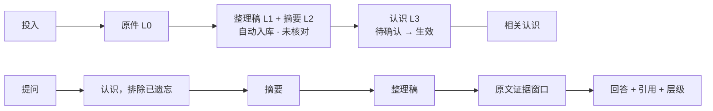

# 架构

更新：2026-10-03（新增 §0 设计理念、§7 模块与替换；§4 场景改为带项目层）。2026-10-03（二）：新增 §8 部署与计算放置（同日修订：服务器多用户、管理员为最高权限、手机分担轻计算、每个用户自己配置模型密钥、共享项目 §8.6、分享对话 §8.7）；§7.3 增加 search、nudge 两个接口；§7.6 增加一份材料拆到多个项目、别人的画像放哪。2026-10-03（三）：新增 §9 接入通用 agent；§7.3 增加 handoff 接口；同日增补 §9.5–§9.7（借鉴的接入方式、代理接入、方法导出为 skill）。2026-10-04：§5.4、§5.5 增加接着写、需更新、灵感引用、去别的项目问和你定的提醒；§7.3 增加 elsewhere、continuation、style、stale 四个接口；新增 §7.7 成果。同日：§5.4 增加续读与断网重试（T14.5），§7.3 增加 retry 接口。2026-10-06：§4、§5.2、§5.4、§5.5 增加使用信号、纠偏、待补、停止生成与请求编号；§7.2 增加信号相关的事实与推导；§7.3 增加 reask、review、gap 三个接口；新增 §7.8 使用信号；§8.3 增加日志与每日自动备份。同日（二）：§8.3 增加安装包与数据根分开（U4）。2026-10-07：§4"向量本地优先"补上本机档；§5.2 增加向量的本机 / 外接模式与安装；§8.2 向量的本机档改为 EmbeddingGemma 2；§8.4 服务器上共用一份向量模型（plan"用户追加：本机向量"V0–V3）。执行顺序见 [notes/plan.md](notes/plan.md)，设计见 [DESIGN.md](DESIGN.md)，公共能力见 [COMPONENTS.md](COMPONENTS.md)，规则见 [AGENTS.md](AGENTS.md)。

## 0. 设计理念（2026-10-03 用户与设计方讨论）

第二大脑做两件事：把你投喂的材料和日常执行长成你自己的理念；你干活时，带着这些理念补全上下文和你没注意到的方法。下面是理念，模块怎么分、怎么替换见 §7。

**记忆**
- **三种认识**：基础认识来自模型本身，靠选模型解决，不进记忆系统；理论认识来自读过的材料（方法、概念、用词和风格）；经验认识来自执行中的案例、纠正和例外。理论和经验都用"认识"承载，靠来源和适用条件区分，不分库。
- **只记出乎意料的部分**：读材料时，记它和你已有认识的差别（补充、不同、新方法）；执行时，记系统输出被你改掉的地方。只是重复已有认识的材料不新增条目，只给原认识添一个独立来源。
- **方法按"什么时候该想起"来存**：事实按话题找，方法按情境找。方法类认识写明适用条件；干活时按情境找方法，去掉你已经写到的，剩下的就是该补的。
- **强度只管想不想得起来，不管对不对**：使用和遗忘只影响召回排序。对错由纠正、有效时间段和来源决定：你本人 > 当事人原话 > 资料 > 模型推断，同一级取更晚的；没有依据裁决的矛盾并列展示。只进了上下文、没被引用的不算使用。
- **你的动作立即生效，系统的推断延后**：确认、编辑、纠正、遗忘、改归属当场写入；从中归纳新方法放在后台进行。

**范围**
- 三层：我（画像，所有项目可见）→ 项目（方法和基础知识，项目下所有场景可见）→ 场景（这个案子的事实，只在本场景可见）。兄弟场景互相隔离。事实留在场景里，方法经你确认后上升到项目。
- "我"只放你本人：画像和你确认过的通用立场，不放你读过的材料。

**工程**
- **事实只追加，推导可重建**：能重新算出来的，不当作事实存。
- **决策点是带版本号的纯函数**：换算法就是登记一个新版本，改一行切换，改回来就是回退。
- **三条管线，一个入口，只通过事实交流**：记住、问和干活、学习三条路径分开；入口、接口、执行器和事实日志共用。
- **每个事实只有一个主人**：记忆事实归领域服务，执行事实归内核，编排层和界面不拥有状态。

## 1. 产品即架构

| 入口 | 用户动作 | v2 接口 |
| --- | --- | --- |
| 工作台 | 在一个输入框里记住、问、干活；每轮产出一条回执；右侧聚焦面板；右下角进度托盘 | `/api/v2/workbench`、`/api/v2/jobs` |
| 资料库 | 四层下钻；确认、编辑、连接、遗忘；收件箱归类 | `/api/v2/library` |
| 设置 | 模型、隐私、项目、数据 | `/api/v2/settings`、`/api/v2/projects`；模型表单暂用 `/api/recognition/settings*` |
| 伙伴 | 聊聊、回顾、专注、安排 | 沿用 `/api/rebuild/companion/*` |

## 2. 五个名词与记忆阶梯

| 名词 | 层 | 权威存储（复用，不新建） | 状态 |
| --- | --- | --- | --- |
| 项目 / 场景 | — | 新集合 `v2_projects`；内置 `inbox`（收件箱）和 `me`（我） | — |
| 原件 | L0 | `workspace_items`（原文、原件路径）；JSON Source；`runtime/workspace/`、`library/` | — |
| 整理稿（含摘要） | L1 / L2 | `core/document_engine`（`documents`、`document_revisions`）；摘要是 markdown 中的 `## 摘要` 小节，旧文档取标题后的第一段 | 未核对 / 已核对（由推导得出，见 §4） |
| 认识 | L3 | `backend/recognition`：`recognition_candidates`（待确认）与 `recognitions`（生效 / 需复核），由 Insight 读模型合成；遗忘记录在 `recognition_recall_preferences.state = "forgotten"` | 待确认 · 生效 · 需复核 · 已遗忘 |
| 对话 | — | 新集合 `v2_threads`、`v2_turns`；"干活"沿用 `recognition_tasks` 与 Turn 调度 | — |

内部对象不出现在界面上：
- Experience：认识的来源类型。
- ContextPacket 与 `workspace_ask_receipts`：外发回执。
- ProcessingLease：处理租约。
- Job / Turn：执行机制。



## 3. 代码位置与依赖

```
src/core/                         领域与存储；不依赖 backend
src/backend/memory_app/           产品应用层（ASGI 入口：backend.memory_app.app:app）
  workspace_*.py                  投入 / 审核 / 入库 / 问答领域服务（复用）
  source_egress.py                外发授权（改为：默认允许，私密除外）
  recall_preferences.py           召回偏好（新增 forgotten）
  v2/                             新产品接口（本轮新建，只有这一处）
    __init__.py                   install_v2_routes(application, *, runtime_root, records, models, documents, service, workspace)
    privacy.py                    唯一外发判断：allow_remote + 私密项目（v2 代码只经它判断）
    projects.py                   v2_projects、场景、场景归属
    intent.py                     parse_scope_tag、route_intent 纯函数
    layers.py                     summary_of / facts_of、核对状态
    auto_confirm.py               处理 → 自动入库
    insight_generation.py         入库后生成 2–3 条短认识（待确认）
    insights.py                   resolve_insight（候选 id → 认识 id）、insight_view
    ladder.py                     逐层下钻召回 plan_ladder
    workbench.py                  线程与轮次：记住 / 灵感 / 问 / 干活
    library.py                    四层读模型、下钻、动作
    settings.py                   模型与隐私门面
    jobs.py                       托盘汇总、周统计
src/backend/recognition/          认识领域（复用）
src/backend/api/                  旧 OS 应用（约 700 条路由），等价核对后逐步删除；新代码不得加在这里
src/frontend/src/
  styles.css                      唯一 token 来源
  shared/ui/                      新组件（见 DESIGN.md 第 7 节）
  features/workbench/             新工作台
  features/library/               新资料库
  features/settings/              新设置
  features/companion/             伙伴页（重做界面，复用 companionApi）
  features/{workspace,recognition,intake,rebuild}/   旧代码，阶段 7 删除
```

- `install_v2_routes` 在 `memory_app/app.py:create_app` 中、`install_workspace_routes` 之后调用。v2 需要的 `WorkspaceItems`、`WorkspaceIntake`、`WorkspaceReview`、`WorkspaceQuery` 实例由 `install_workspace_routes` 返回，放在一个 `WorkspaceDomains` 对象里传给 v2，**不要重复构造**，因为问答预览表和锁按实例独占。
- v2 只在 `documents.namespace_id == "default"` 时安装。否则记录日志并跳过，旧接口不受影响。

## 4. 关键规则（实现必须满足）

**自动入库**
- 处理成功（`status == "ready"`）后，v2 编排立即调用 `WorkspaceReview.confirm(item_id, {"project_id", "expected_revision": <ready 行的 revision>})`。
- 失败时保持 `ready`，托盘显示失败，并允许重试确认。

**未核对**
- 满足任一条件即为"已核对"：`v2_verifications/{document_id}` 存在，且其 `document_revision` 小于或等于当前修订；或者 `documents.revisions(document_id)` 中存在 `operation == "user_edit"` 的修订（由 `save_user_edit` 写入）。其余情况都算"未核对"。
- 不写回 `workspace_items`。

**认识**
- 生成的认识只能进入候选（`RecognitionService.propose`）。
- "确认"调用 `publish`，"编辑"在确认前调用 `edit_candidate`、确认后调用 `revise`，"丢弃"调用候选拒绝。

**遗忘**
- 写入 `recognition_recall_preferences.state = "forgotten"`。
- `v2/ladder.py`（工作台问答）和 `recognition_retrieval`（任务上下文）都通过同一个 `is_recall_excluded(records, scope, recognition_id)` 排除它。
- "恢复"即改回 `normal`。
- 原件与修订不动。

**外发**
- 授权条件：`ModelConfiguration.allow_remote`（ASR 另看 `enabled`），且资料不属于私密范围；判断入口只有 `v2/privacy.py:egress_allowed`。
- 私密分两种：
  - 项目私密：`v2_private_scopes/{project_id}`。
  - 私密范围修订号：`v2_privacy_state/default`，payload `{"revision": n}`，与私密改动同一事务递增。
  - 单条资料私密：`source_policies` 中 `allowed_purposes == []`。这条记录不随来源修订失效。
- 没有策略的资料默认允许全部用途。
- 每次外发的回执都记录 `consent_scope: "global_setting"` 和 `settings_revision`。
- 抓取用户贴入的链接（网页、公众号、视频页）不算外发：它只是按用户的要求下载内容，不发送用户资料，不受模型外发开关和私密标记限制；但必须防止访问内网（拒绝内网和本机地址、非标准端口，DNS 固定 IP，限制重定向次数和响应大小，不带 Cookie 和认证信息）。抓回的内容进入整理、调用模型时，才按外发规则执行（2026-10-01 设计方裁决）。

**逐层下钻召回**（召回方向与下钻相同：先查认识，不够再往下）

`WorkspaceQuery.collect_candidates` 产出带 `layer`/`scope`/`document_id` 的候选（沿用原有条件完整性、1800 字单元、冗余去重规则），`v2/ladder.py:plan_ladder` 逐层选择：

| 层 | 取什么 | 上限 |
| --- | --- | --- |
| L3 认识 | 当前项目（场景范围内）生效、未遗忘的认识 | 3 |
| 画像 | `me` 项目中匹配的认识，标记 persona，不参与充分判断，受外发规则约束 | 2 |
| L2 摘要 | 先取已选认识所连文档的摘要窗口，再取其他命中 | 2 |
| L1 整理稿 | 先取已选文档的正文窗口（不含摘要区间），再取其他命中 | 2 |
| L0 原文 | 先取已选文档对应工作项/Source 的原文窗口，再取其他命中 | 2 |

- **充分即停**：已选证据对 `query_terms(question)` 的加权覆盖率 ≥ 0.6 且至少 1 条证据。
- **细节类问题**（含"原文/原话/具体/出处/哪一段/怎么说/数据/多少/引用"）至少取到 L1 或 L0。
- **场景**（用户 2026-10-03 决定，T12.12 实现）：给了场景，每层取归属本场景的对象和项目层对象（未归属任何场景的），不取兄弟场景的；同分时本场景优先。T12.12 之前只取本场景。文档归属可继承给其摘要、正文、认识；没给场景则全项目。
- **总预算**：现行为 8 条（含画像 2 条）；T10.4 之后改为按 token 计：B = min(6000, (窗口 − 输出预留) × 0.5)，其中 20% 留给指令、问题和对话历史，证据贪心装入，单窗口最多 1200 tokens，各层条数上限不变。同分按更新时间新者在前（T10.3）；覆盖率不足时改写问题再查一次（T10.2）；追问带同线程最近 3 轮问答（T10.1）。每层输出 `trace: {layer, considered, selected, coverage, stopped}`，回答回执携带它，界面"本次用了什么"据此展示在哪一层停下。
- **校验**：`validate_ask_plan` 使用候选自身的 `scope` 校验（画像认识属于 `me` 项目）。

**类人记忆与遗忘**（2026-10-01 用户决定，plan 阶段 10）
- **短时 → 整理 → 长期**：
  - 新材料（原件、整理稿、摘要）和当前对话是短时记忆。
  - 从单篇资料生成的认识候选是初步印象，30 天没被确认就从待确认列表淡出（T10.8）。
  - 每日整理（T10.10）把近 7 天里跨来源反复出现的内容归纳成规律性认识候选（`kind: pattern`），并合并重复、发现连接；用户确认后进入长期记忆（L3）。
  - 画像（`me` 项目）确认后直接进入长期记忆。
- **遗忘曲线**（T10.5、T10.6）：
  - 认识和整理稿各有一个使用分，存放在 `v2_usage_*` 中。被引用、被送入模型、被打开都会加分（T12.7 起，只送入模型、未被引用的不再加分，并同时保存使用事件明细）；分数按半衰期衰减，半衰期 h = 30 天 × (1 + ln(1 + 使用次数))，画像的 h 再乘 3。
  - 确认或入库满 30 天后才开始处理：认识分数 < 0.25 降权（权重 0.5），< 0.0625 自动遗忘；整理稿和画像只降权。降权的分数回到 ≥ 0.5 时自动恢复。
  - 召回偏好带 `by: user|auto`；手动状态优先。召回权重统一由 `recall_weight(kind, id)` 提供。
- **书架与元记忆**（T10.7）：
  - 自动遗忘的认识和降权的整理稿有"书脊"（标题、类型、场景、日期，认识取正文）。
  - 每次问答在阶梯之后查一次书脊，命中就是"知道自己忘了"。阶梯不充分时，最多翻出 2 条作为证据，引用标记 `bookshelf: true`，回答里要说明是已淡忘的内容；阶梯已充分时只在回执里记录命中数。
  - 翻书后被引用的，恢复为降权、分数设为 0.5（再学习更快）。手动遗忘的内容永不进入书脊检查。
- **连接**（T10.9）：
  - "相关"自动建立，存放在 `v2_insight_links` 中；"支持 / 矛盾 / 取代"由模型建议、用户确认，写入 `recognition_relations`。
  - 召回时沿"相关 / 支持"带出最多 2 条邻居；有"矛盾"的一并带入，并说明分歧；确认"取代"后旧认识降权；被使用的认识，其直接邻居各加 0.2 分。
- **永不删除**：以上所有变化只影响自动召回，不改原件、整理稿、认识的正文和修订。
- **向量本地优先**：向量地址是本机时视为本地；用远端时按外发规则执行；都没有时退回关键词。向量仍存在现有的 SQLite 缓存里，不引入向量数据库。
  - 本机档（2026-10-07，V1）：EmbeddingGemma 2 在 `/local-model/v1/embeddings` 提供 OpenAI 兼容接口，访问规则同本机生成；进程里只加载一份，查询先于后台索引。维度、前缀等放在 `vector@1`，缓存的模型键带维度和策略版本，换了就重建。本机档不算外发，私密内容也可以用。
  - 图片（V2）：图片与文字在同一个向量空间，只在本机档计算；图片相似度只作为所属原件的一个检索信号，与它的整理稿、摘要的分数融合，不新增记忆层，下钻顺序不变。外接档不送图片。
- **向量缓存失效（T14.3）**：检索只按项目、条目ID、修订、模型四键读取，失配即未命中，不清扫。资料/原件/认识修订及私密写入口按当前来源资格精准失效，产品装配向领域写服务显式注入两阶段来源复验与删除；裸领域服务仅自身和同范围级联。CAS、原件或worker证明失败不删缓存，缓存删除失败回滚正式写；跨库缓存已删而正式提交失败时允许重建缓存。既有DailyJobs每日兜底仅清无资格、损坏来源或过期派生向量，不删除业务事实、不调用模型。

**认识身份**
- 候选发布后，候选 payload 中有 `recognition_id`。所有 v2 接口与回执统一用 `resolve_insight` 解析 id，回执中保存的候选 id 在确认后仍然有效。
- Insight 带 `aliases`（原候选 id）。

**统一 AI 内核（阶段 11 目标，2026-10-02 用户决定）**
- 整理、形成认识、每日整理、认识连接、问、干活，每一次 AI 行动都是内核里的一次 Turn；领域服务只做读写与校验，不直接调用模型网关。
- 干活：管家参考以前相似任务的分工样例拆成工作项 → 直接开工，不等批准 → 子智能体并行干各自那一份（各自召回上下文、在分工写明的能力内调用工具、交出部分成果）→ 主智能体汇总成一篇整理稿；完成后用户可调整分工并重做，分工存为样例（旁路集合 `v2_task_divisions`）供以后参考（T11.9）。免批准只覆盖 `draft_create_only` 能力（只新建草稿或待确认候选，不改不删已有对象、不外发第三方），且只在 `project.task` Turn 冻结的分工能力子集内；其他写能力仍需批准，Boundary 的 deny 与私密规则照常生效。
- 外发判断在 Turn 冻结时由 `v2/privacy.py` 算好写进 `privacy`；外发记录、用量、"本次上下文"统一从内核模型调用回执投影。
- 内核组装从 `backend/api` 迁到 `backend/memory_app/kernel/`（T11.1），之后才删除旧后端（T7.3）。下面"任务内核冻结"一节在阶段 11 完成前继续有效。

**任务内核冻结**
- "干活"的任务、批准与生成仍走现有 `/api/recognition/tasks` 与 Turn 调度，不修改 `memory_app/turn_*`（T1.1 的导入倒置除外）。
- 多智能体组织路径（`/api/ai/agent-turns`：主 Agent → 管家 → 专家）于 2026-10-01 解冻，范围见 plan 阶段 9。目标形态如下：
  - 专家结论（不超过 2000 字，敏感片段替换为占位）随 `agent.list` 与 fan-in 结果交回主 Agent；
  - 每个档位带 `instructions`，作为 `agent-role-brief-v1` 随 Turn 冻结，并进入模型输入的 `role`；
  - 管家由模型决定派谁、做什么，名额、预算、能力仍由代码计算，模型不可用时退回规则；
  - 管家和专家的 Turn 在 runner 的独立子线程池中执行，与主 Agent 互不占用线程；
  - v2 干活在允许外发时，先由组织做只读研究，主 Agent 的综合结论作为参考消息写进任务上下文包，再进入原有的批准与生成；不允许外发时流程不变。

**逐条授权删除**（2026-10-01 用户决定，T7.6）
- 外发判断只经 `v2/privacy.py`。`source_egress` 的按用途逐条授权删除，`allowed_purposes` 只剩两态：`[]` 表示单条资料私密，其他值一律视为全部允许。私密沿派生关系继承。来源身份、修订、闭包与发送前后复验保留。

**项目**
- `v2_projects` 保存名称、场景列表、私密标记。
- 首次读取时，把已存在于 `workspace_items`、`documents`、`recognitions` 中的 `project_id` 幂等登记进来（`default` 显示为"日常"；旧的占位名"默认"只在显示时换掉，`#默认` 仍能解析到它。2026-10-08 用户要求修正"#默认"），同时确保 `inbox` 和 `me` 存在。

**场景归属**
- 存在 `v2_scene_assignments/{object_type}:{object_id}`，字段为 `{project_id, scene}`。

**记忆调优（阶段 12 目标，2026-10-03 用户决定）**
- 长资料按块建索引，块的检索文本带本资料标题和摘要作前缀；命中后仍映射回原资料，阶梯与引用契约不变（T12.1）。
- 阶梯召回跳过与已选材料高度重复的条目，refutes 配对与同一资料上下层除外（T12.2）。
- 项目与场景概览（`v2_scope_overviews`）只做导航，不作为引用对象（T12.3）；已确认画像固定放在提示词开头，模型不能写画像（T12.4）。
- 新候选标出"重复/可能取代"，只提示不自动执行（T12.5）；认识有效时间段（`v2_insight_validity`）支持"当时怎么认为"（T12.6）。
- 每日整理在固定 24 小时之外，可按项目内积累的纠正提前触发，也可以在资料库手动运行一次（T12.7）；覆盖度不足时先列出缺口再定向下钻（T12.8）。
- 不引入：自动删除记忆、自动改写已有认识、模型自行编辑长期记忆。
- 2026-10-03 设计调整（见 §0、§7）：决策点收进带版本的策略（T12.11）；场景带项目层（T12.12）；新候选对照已有认识提炼（T12.5）；材料归属建议与跨项目移动（T12.13）；按情境补全方法（T12.14）；每日整理以纠正为主要输入（T12.7）。
- 2026-10-04 增补：收件箱里的灵感参与各项目的问和干活，想点子时多取（T12.16）；当前项目问不到而别的项目明显相关时，回执提示去那里问，不自动跨项目查（T12.17）。
- 2026-10-06 增补：使用信号按三条规矩收集（§7.8）；含糊的信号在"纠偏"里列给你打勾确认（T12.20）；答不上来的问题汇成"待补"（T12.21）。

## 5. v2 接口契约

所有请求体与响应都是 JSON。错误格式为 `{"detail": "<code>"}`，409 冲突时带上 `current`。所有写接口都要求 `project_id`；修改已有对象时还要求 `expected_revision`。

### 5.1 项目 `/api/v2/projects`
- `GET /api/v2/projects`
  → `{"items":[{"id","name","scenes":[str],"private":bool,"builtin":"inbox"|"me"|null,"revision":int}]}`
- `POST /api/v2/projects` `{"name"}` → project
- `PATCH /api/v2/projects/{id}` `{"name"?,"scenes"?,"private"?,"expected_revision"}` → project

### 5.2 设置 `/api/v2/settings`
- `GET /api/v2/settings` → 
  ```json
  {"model": {"generation": {"provider","model","base_url","configured","location":"remote|local"},
             "asr": {"provider","enabled"}, "embedding": {"enabled"}, "rerank": {"enabled"},
             "vision": {"provider","model","base_url","configured","allow_remote","mode":"local|remote","mode_revision","local":{"provider","status"}},
             "search": {"purpose":"search","provider","model","base_url","configured","enabled","allow_remote","revision","has_api_key"},
             "local": {"available","enabled","selected","model"}},
   "external_agent": {"revision": int,"allow_remote": bool,"include_profile": bool,"daily_limit": int,"clients":{"claude":bool,"codex":bool}},
   "privacy": {"allow_remote": bool, "private_projects": [id], "private_source_count": int, "egress_receipt_count": int},
   "revision": int}
  ```
- `PATCH /api/v2/settings/external-agent` 接受完整 `{allow_remote,include_profile,daily_limit,clients:{claude,codex},expected_revision}`；默认外发关、画像开、每日200次、两客户端开，由独立旁路owner与CAS保存，同值不增修订；非法字段400、修订冲突409；GET遇已存设置损坏返回503。响应为 `external_agent` 的上述独立配置，不含凭据；该用途的来源私密与实际交付权限由每个原Kernel Turn复验。
- `PATCH /api/v2/settings/privacy` `{"allow_remote"?,"private_projects"?,"expected_revision"}`
- `PATCH /api/v2/settings/vision-mode` `{"mode":"local|remote","expected_revision":int}` → vision公共配置；模式默认local，独立CAS；非法输入400、冲突409。vision沿现有模型配置/密钥owner、按独立用途复核全局外发许可，私密回退本机；公开配置不含密钥或secret_ref。本机状态ready/unavailable，应用不自动下载OCR依赖或资产。
- 本机向量（V1–V3，2026-10-07）：
  - `PATCH /api/v2/settings/embedding-mode` `{"mode":"local|remote","images"?:bool,"expected_revision":int}`，独立旁路 `v2_embedding_mode/default`，修订冲突 409；没有存过模式时，已有可用的外接向量配置就按外接，否则按本机。
  - `POST /api/v2/settings/embedding/install` `{"expected_revision":int}` → 202，后台下载到数据根 `data/models/`（server 形态为 `<服务器根>/server/models/`，只有管理员能装）。
  - 读模型 `model.embedding` 增加 `"mode","mode_revision","images","local":{"model","dims","status":"missing|installing|ready|failed","progress":{"done","total"}|null,"index":{"done","total"}|null}`。
- T15.9 搜索沿上述 model.search 公共配置，默认 enabled/allow_remote 均为 false；配置和密钥仍走原模型用途 owner。只有本地证据不够且问题具有时效时，经原辅助 web.search Turn 搜一次，私密项目不搜，写搜索用途回执；仅被回答引用的结果通过原资料事务入库。完整工厂与真实搜索验收状态见 Q65。
- 模型编辑继续使用现有的 `GET/PUT /api/recognition/settings`、`PUT /api/recognition/settings/generation-mode`、`POST /api/recognition/settings/test`。
- T15.2平台密钥工厂保持Windows DPAPI与原位置；非Windows使用部署主密钥加密的用户根`secrets.json`。主密钥缺失、解密失败、文件不合规或存储不可用经既有`{"detail":安全码}`返回503，不返回密钥、路径或提供方错误正文；请求字段与成功响应保持。

#### 5.2.1 ChatGPT 订阅 `/api/v2/settings/subscriptions`（M4 用户批准）

设置是全局操作，不要求 project_id。仅新增旁路集合 `v2_subscription_profiles`、`v2_subscription_installation`、`v2_subscription_refresh`、`v2_subscription_selection`；已有原件、整理稿与认识 payload 保持。所有公开响应不含 access/refresh/ID token。

- `GET` → `{provider,connected,sharing,identity:{email,name}|null,revision,state,login:{attempt_id,expires_at}|null,selection:{provider,model,revision,account_revision},allow_remote,generation_revision,selection_ready}`。
- `POST /login` `{expected_revision}` → `{attempt_id,authorization_url,expires_at}`；浏览器授权只回到临时 127.0.0.1 监听器，验证 state、PKCE、签名、issuer、audience、nonce 与使用权限。
- `GET /login/{attempt_id}` → `{state:pending|completed|failed,error?,expires_at}`；`DELETE` 取消。完成/超时/取消/应用退出均关闭监听器，授权码不记日志。
- `GET /models` → `{items:[{id,name}]}`，只列出当前 OAuth 模型目录中 visibility=list 的 slug，不复用 API Key 的 data/id 目录。
- `PATCH /selection` `{model:str|null,expected_revision,allow_remote?:bool,expected_generation_revision?:int}` → selection。开关仍是原全局 generation.allow_remote；修改时要求其 CAS 修订。登录/选择不自动开启外发；选择订阅时保存的 API 配置恢复到 API 模式，本机安装及配置继续通过原模式选择恢复。订阅选择绑定账号修订，重新登录必须重选，认证失效保持订阅选择并阻止生成，不自动降级到其他凭据。
- `POST /logout` `{expected_revision}` → `{remote_revoked:bool}`。先清除本机令牌和身份，仅保留加密注册 client_id，再撤销远端 refresh grant；远端未确认时明确提示查看账号。

刷新通过 SQLite 租约跨实例串行化，轮换凭据先加密保存为待校验状态，JWKS 暂时失败后复验同一轮换而不重复兑换。刷新回复不确定或过期租约缺轮换检查点时要求重新登录。Responses 传输固定官方地址、store=false、无自动重发；JSON 与 SSE 均复用原授权/来源复验/严格结果校验/保存服务及幂等规则，只接受 response.completed 的最终输出。

M4.1：取消调用方不会取消已经开始的同步刷新，应用关闭通过同一生命周期锁等待轮换保存后再关闭 HTTP 客户端。明确的临时服务失败保留授权，刷新回复丢失或失效 grant 停止使用该令牌并保留注册 client_id；监听失败直接通过现有错误交付返回，不使用其它进程的回调端口。HTTP 与失败流只保留安全的状态、已知错误码、类别和正文/工具是否已开始；模型配置层沿用原公开错误文案并传递这些内部事实。容量不足与临时故障仅在正文/工具输出前提供可重试提示，用量限制、权限与不支持能力不提供该提示；实际重试由 Turn 的 T14.5 策略负责，适配器不自行重发。

- `GET /api/v2/settings/integrity` → `{"ok","checked_at","problems":[{"code","count"}]}`，只读；code 为 `sqlite_corrupt`、`source_file_missing`、`source_without_document`（D5，2026-10-02）。
- 使用记录（T12.18，§7.8）：
  - `GET /api/v2/settings/signals` → `{"enabled","count","retention_days":180,"cleared_at","revision"}`；
  - `PATCH /api/v2/settings/signals` `{"enabled","expected_revision"}`；
  - `POST /api/v2/settings/signals/clear` `{"expected_revision"}` → `{"cleared"}`；
  - `POST /api/v2/signals` `{"project_id","kind":"copy|view","turn_id"?,"object"?,"client_id"}` → 204，开关关闭时不写；`stop` 只由服务端写（T14.11）。

### 5.3 托盘 `/api/v2/jobs`
- `GET /api/v2/jobs?project_id=` → 
  ```json
  {"items": [{"id","kind":"intake|task","title","state":"processing|pending|failed|done",
              "progress":{"done":int,"total":int}|null,"pending_count":int,"error":str|null,
              "target":{"type":"item|task|turn","id"},"updated_at"}],
   "counts": {"processing":int,"pending":int,"failed":int}}
  ```
- 工作项的映射：
  - `staged` / `processing` → processing。进度：原件 1 / 正文 2 / 整理 3 / 入库 4。
  - `ready` 表示自动入库失败 → failed。
  - `confirmed` 且仍有待确认认识 → pending。
  - `failed` → failed。
- 任务的映射：
  - `queued` / `running` → processing。
  - `waiting_approval` → pending。
  - `failed` / `interrupted` → failed。
  - `completed` 只在 24 小时内显示为 done。

### 5.4 工作台 `/api/v2/workbench`
- `POST /api/v2/workbench/turns` `{"project_id","thread_id"?,"text"?,"item_id"?,"intent"?}`
  - `intent` 省略时由 `route_intent` 决定。阶段 13 起：`intent` 省略或为 `"auto"` 时由 `v2/route.py` 先走快速通道，否则调用内核 `workbench.route` Turn，失败或不允许外发时退回 `route_intent`；路由得到 1 个部分时回执与原来相同，多个部分时 `turn.intent = "multi"`，`receipt.parts[]` 各含 `index、intent、span、instruction、depends_on、state` 和该意图原有的回执，`receipt.route = {mode, usage, egress_receipt_id}`；SSE 的 `started` 带 `parts`，`delta` 带 `part` 序号（T13.2）。问和干活部分可带 `situation`（≤ 60 字），只冻结进对应 Turn 供补全使用，不进回执（T13.2 增补）。路由样例存 `v2_route_examples`（T13.4）。
  - `item_id` 是先通过 `POST /api/v2/workbench/files`（multipart）上传得到的工作项。必需`file`保留旧`WorkspaceIntake.add_file`路径；可加重复`files`，由`add_images`按`[file,*files]`原序合成一原件，总量含首张不超过既有12MiB限制。`WorkspaceItems.create_upload`同事务创建owner、图组旁路及原件索引，失败清理原图。
  - 返回 `{"thread_id","turn":Turn}`。
  - 问答默认返回上述 JSON。`Accept` 协商优先 SSE 时返回 `text/event-stream; charset=utf-8`；先按最具体匹配范围确定各表示的权重，再比较权重，同权重优先 JSON。具体范围的 `q=0` 覆盖通配符；全部不可接受时 406，非法权重时 400。其他意图仅提供 JSON。响应带 `Vary: Accept` 与 `Cache-Control: no-store`。
  - SSE 事件：`started` 为 `{"thread_id","turn":{"id","intent","user_text"}}`，`delta` 为 `{"text":str}`，`done` 为完整 JSON 回执，`error` 为 `{"code":安全错误码}`。开始传输后的错误通过 error 交付；增量仅供临时显示，引用及完整回执在 done 后生效。
  - 可选 `Idempotency-Key` 为 1–128 位字母、数字、下划线或连字符，首位为字母或数字；前端问答始终发送。`v2_turn_requests` 旁路保存 running/completed/failed/interrupted，同键须携带相同请求体，冲突为 409；完成重放原回执，运行中返回 `turn_in_progress`，失败重放原错误。JSON 和 SSE 共享业务执行服务，授权、生成、校验、保存只执行一次，最终轮次与 completed 状态在同一事务落盘。
  - 断流只停止交付，服务端继续执行并持续复验授权及来源，校验完成后保存最终回执。刷新可读取线程历史；同键重接在完成时重放 done，运行中只返回状态，不重新调用模型。服务重启遗留 running 转 interrupted，不自动重新生成。失败或 interrupted 后只有用户显式重试并使用新键才能再次生成；前端保留不确定请求键并禁止自动 POST 重试。未提供键的旧客户端不承诺 POST 重试去重。
  - 断网与中断（T14.5，按 Claude Code 的标准）：模型连接在正文开始前的瞬时故障按 `retry@1` 自动重试，最多 10 次、指数退避，每次都重新复验外发；正文开始后不自动重试，保留已完成部分（问的回执 `partial`，标中断），由用户点"继续"。运行中断开的客户端用 `GET /api/v2/workbench/turns/{turn_id}/stream?project_id=&after=<序号>` 续读（SSE，事件带 `id`，接受 `Last-Event-ID`）：先补发已生成的部分，再接着推送；续读只读，可自动重连，POST 仍不自动重发。流每 15 秒一条心跳注释，响应带 `X-Accel-Buffering: no`。
- `POST /api/v2/workbench/turns/{turn_id}/steer` `{"project_id","text"}` → `{"steer_id","state":"queued"}`（T13.6 中途插话）：只对进行中的问和干活；带 `Idempotency-Key`，文字 1–2000 字；Turn 已结束返回 409 `turn_finished`，超过 5 次返回 409 `steer_limit`。Turn 增加 `steers: [{id,text,at,state:queued|applied|unapplied,applied_to:{part,step}}]`；SSE 在原连接上增加 `steer` `{id,state}` 与 `reset` `{part}`（问重新生成时清掉临时增量）。插话在下一个步骤边界读取，不解析标签，范围、私密和外发沿用该 Turn 冻结的设置。
- `POST /api/v2/workbench/turns/{turn_id}/stop` `{"project_id"}` → 202 `{"state"}`（T14.11）：问保存部分回答，状态为 `stopped`；干活保留已完成的工作项；之后沿用 T14.5 的"继续"。重复调用返回同一结果，已结束的轮返回 409 `turn_finished`。
- 所有响应带 `X-Request-Id`，与日志行对应（T14.12）。
- `POST /api/v2/workbench/turns` 增加可选 `continue_from`（T13.7）：成果的 document_id，指定接着写哪篇；`context_ids`（可选，T13.9）："更新"时指定的上下文对象。干活回执增加 `continues: {document_id, version}|null`、`changes: [{path, kind: added|updated}]`、`fallback_new: bool`（T13.7）。
- 问的回执增加 `elsewhere: {project_id, scene|null}|null`（T12.17）；引用的 `layer` 可为 `inspiration`，`layers` 增加 `inspiration`（T12.16）。记住的回执在你定的提醒时增加 `remind: {reminder_id, at}`（T15.10）。
- `GET /api/v2/workbench/threads?project_id=` → `{"items":[{"id","title","updated_at"}]}`
- `GET /api/v2/workbench/items/{item_id}/images?project_id=` → `{"images":[{"ordinal","name","url"}]}`，序号从1开始。有效已确认文档体完全对应封印旁路及confirmation operation时，附`image_read:{"provenance":"image_read.model_inference","epistemic_status":"unverified","document_revision","sections":[{"ordinal","text"}]}`；编辑过的正文不附此资格。
- `GET /api/v2/workbench/items/{item_id}/images/{ordinal}?project_id=` 下载原图；复验当前project/item owner及工作区边界，不公开绝对路径，跨项目/越序404，失效图组/文件409。
- 识图使用既有MemoryTurn的`media.image_read`无工具aux与`image_read@1`纯策略。`v2_vision_mode`、`v2_image_groups`、`v2_image_reads`、`v2_image_read_bindings`保存新状态；旧payload保持。请求冻结与身份绑定CAS同事务，MemoryTurn key/request为后续既有事务，孤立绑定无执行权；ProcessingLease与owner更新、图读旁路封印同事务。OCR为原文，看图描述≤200字/图，作为L1模型推断且unverified，提炼仍需人确认。
- `GET /api/v2/workbench/threads/{thread_id}?project_id=` → `{"id","turns":[Turn]}`（回执状态实时刷新）
- `POST /api/v2/workbench/turns/{turn_id}/approve` `{"project_id"}` → Turn（干活：转交 `/api/recognition/tasks/{id}/approve` 的实现）
- `POST /api/v2/workbench/turns/{turn_id}/retry` `{"project_id"}` → Turn

Turn 的结构：
```json
{"id","thread_id","intent":"remember|inspiration|ask|do","user_text","created_at",
 "receipt": {
   "remember":   {"item_id","title","state":"processing|done|failed","progress":{"done","total":4},
                  "document_id"|null,"verified":bool,"insights":[Insight],"related":[{"id","text"}],"error"|null},
   "inspiration":{"insight":Insight},
   "ask":        {"answer","citations":[{"n","layer":"insight|summary|note|source","persona":bool,"id","title","quote","locator"}],
                  "layers":{"insight":int,"summary":int,"note":int,"source":int,"persona":int},
                  "trace":[{"layer","considered","selected","coverage","stopped"}],
                  "egress_receipt_id"|null,"no_match":bool},
   "do":         {"task_id","title","state":"waiting_approval|running|done|failed","progress":{"done","total":3},"document_id"|null}
 }}
```
- "记住"是异步的：接口先返回 processing，后台任务依次执行处理 → 自动入库 → 生成认识 → 联想相关认识。前端轮询 thread 或 jobs（每 1.5 秒一次，没有处理中的项时停止）。
- "问"复用同一领域执行：`collect_candidates` → `plan_ladder` → `execute_ask`，不再有预览步骤；JSON 等待最终回执，SSE 交付临时增量与最终回执。网关复用协议能力声明，流式输出不在已交付增量后自动降级或重发模型请求。
- 文本中的 `#项目/场景` 标签由 `parse_scope_tag` 解析：记住时决定归属，问时决定召回范围。

### 5.5 资料库 `/api/v2/library`

T12.5读模型追加可选hint（关系、旧认识、建议去处与名称）；复制来源下钻追加readonly及source_project_id，指向原件所属项目，只读展示，原件不进入目标项目召回。关系提示在v2_candidate_hints，实际提炼清单在v2_extract_inputs；当前近邻、概览及来源许可在创建、发送、返回和候选写入阶段复验。

Insight 的结构（id 可以是候选 id 或认识 id，一律经 `resolve_insight` 解析）：
```json
{"id","aliases":[str],"kind":"candidate|recognition","text","conditions":[str],"state":"pending|active|stale|forgotten",
 "scene"|null,"source_count","document_ids":[str],"related":[{"id","text"}],"revision"}
```

接口：
- `GET /api/v2/library/insights?project_id&scene?&state?&q?`
  → `{"items":[Insight],"counts":{"pending","active","stale","forgotten"}}`
- `GET /api/v2/library/summaries?project_id&scene?&q?`
  → `{"items":[{"document_id","title","summary","source_type","created_at","verified"}]}`
- `GET /api/v2/library/notes?project_id&scene?&q?`
  → `{"items":[{"document_id","title","verified","created_at","revision"}]}`
- `GET /api/v2/library/sources?project_id&scene?&q?`
  → `{"items":[{"id","title","kind","created_at","url"|null,"document_id"|null}]}`
- `GET /api/v2/library/drill?project_id&from=insight|summary|note|source&id=&document_id?&source_id?` →
  ```json
  {"insight":Insight|null, "grown":[Insight],
   "documents":[{"document_id","title"}], "sources":[{"id","title","kind"}],
   "summary":{"document_id","title","text","source_type","created_at"}|null,
   "note":{"document_id","title","markdown","facts":[{"text","evidence":{"start","end","quote"}}],"todos":[str],"verified":bool,"revision"}|null,
   "source":{"id","title","kind","url"|null,"window":{"pre","quote","post"}|null,"download_url"|null}|null}
  ```
  - 候选文档只有 1 个时自动选中；有多个且没给 `document_id` 时，summary、note、source 为 null，由前端选择。原件同理，用 `source_id` 选择。参数不在候选里返回 404。
  - 有唯一冻结证据时给 `window`，否则 `window` 为 null，前端改用全文接口（2026-10-01 设计方裁决，R1）。
- `GET /api/v2/library/sources/{id}/text?project_id=` → `{"id","title","kind","coordinate_space":"workspace_source_text_v1|source_content_v1","text","url"|null,"download_url"|null,"document_ids":[str]}`。可见范围同 sources 列表，原文不截断；工作台的对照视图和问的引用定位也使用它。
- `POST /api/v2/library/insights/{id}/confirm` `{"project_id","expected_revision"}`
- `POST /api/v2/library/insights/{id}/drop` `{"project_id","expected_revision"}`
- `PATCH /api/v2/library/insights/{id}` `{"project_id","text","conditions","expected_revision"}`
- `POST /api/v2/library/insights/{id}/forget` `{"project_id","forgotten":bool}`
- `POST /api/v2/library/notes/{document_id}/verify` `{"project_id","document_revision"}`
- `POST /api/v2/library/notes/{document_id}/restore-recall` `{"project_id","document_revision","preference_revision"}` → `{"document_id","recall_state":"normal","recall_preference_revision"}`：只恢复当前可见、未归档的降权整理稿，正文修订与偏好修订在原SQLite事务内复验；过期或已恢复返回409，范围不可见返回404。下钻的note存在偏好时附加`recall_state`与`recall_preference_revision`；认识的降权恢复沿原forget接口传`forgotten:false`。正文、来源与核对记录保持。
- `POST /api/v2/library/consolidate` `{"project_id"}` → `{"job_id"}`：对该项目立即跑一次每日整理，进度进托盘；已在运行时返回同一 `job_id`；超过调用上限返回 409 `consolidate_limit`（T12.7）
- `GET /api/v2/library/outcomes/{document_id}/versions?project_id=` → `{"items":[{"document_id","version","created_at","changes"}]}`（T13.7）
- `GET /api/v2/library/outcomes/{document_id}/changes?project_id=` → `{"stale","changed":[{"kind","id","title","from_revision","to_revision"}],"fresh":[{"document_id","title"}]}`；`POST /api/v2/library/outcomes/{document_id}/ack` `{"project_id"}`（T13.9）。整理稿列表里的成果增加 `version`、`stale`、`fresh_count`。
- `PATCH /api/v2/reminders/{id}` `{"at"?,"state"?,"expected_revision"}`：改时间或删除你定的提醒（T15.10）。
- `GET /api/v2/library/signal-reviews?project_id=` → `{"items":[{"id","kind":"reask|unused|stop","title","evidence","effect":"correction|cool","revision"}]}`；`POST /api/v2/library/signal-reviews/decide` `{"project_id","items":[{"id","action":"confirm|dismiss","expected_revision"}]}` → `{"items":[{"id","state"}]}`，修订冲突返回 409（T12.20）。
- `GET /api/v2/library/gaps?project_id=` → `{"items":[{"id","scene","text","count","last_at"}]}`；`POST /api/v2/library/gaps/{id}/dismiss` `{"project_id"}`（T12.21）。
- `POST /api/v2/library/inbox/insight/{id}/file` `{"target_project_id","scene"|null,"expected_revision"}` → 目标项目里的新 Insight。旧参数默认来源inbox、confirm=false，仍返回pending；追加可选source_project_id和confirm。其他来源只接受当前候选提示的目标及显式confirm=true，在同一事务复制来源、发布目标认识并退役原候选，原件不移动（T12.5）。已生效旧收件箱条仍按原规则设为forgotten，私密来源禁止跨项目确认。
- `GET /api/v2/library/inbox/suggestions?target_project_id=` → `{"items":[{"id","scene"|null}]}`，按词重叠给出建议场景，不调用模型。
- 手动"连接"已取消（2026-10-01），`related` 只读。
- `GET /api/v2/stats/week?project_id?` → `{"week_start","remember","confirm","forget","forget_auto"}`，forget_auto单列自动遗忘（T10.6），数据来自 v2 旁路集合 `v2_activity`，周一 00:00（Asia/Shanghai）为界（T5.2）。
- `GET /api/v2/todos?project_id?&include_done=false` → `{"items":[{"id","document_id","project_id","project_name","text","done","done_at"|null,"revision"|null}]}`；`POST /api/v2/todos/{id}/done` 与 `/undo` `{"expected_revision"|null}`。待办来自整理稿"待办"一节，id 由 document_id、同文序号和规范化文本哈希得出；完成状态在旁路集合 `v2_todo_state`，不改整理稿（2026-10-02 设计方裁决，T5.2）。

### 5.6 设备 `/api/v2/devices`（T15.3）

- `GET /api/v2/devices`返回mode、当前device_id及items。设备对象含device_id、user_id、name、created_at、last_seen_at、revoked_at和revision，不含钥匙或key_hash；desktop额外投影本机虚拟设备。
- `POST /api/v2/devices/pair`空对象，返回expires_at、带fragment配对码的url及内存PNG qr；当前有效设备生成，desktop本机可生成，十分钟一次消费。
- `POST /api/v2/devices/exchange`传code和name，返回201的device及唯一一次key；失效/已用/过期401，非法输入400。
- `POST /api/v2/devices/{device_id}/revoke`传expected_revision，返回平铺设备对象；过期CAS409、他人设备404。下一请求401，语音收发中撤权关闭4401并沿原relay清理与client_disconnected回执。
- 单一DeviceRegistry保存server_devices、server_pairings及server_device_presence，初次安装同时建立server_users/local-user管理员。presence不推进权限事实修订，后续多用户和管理员接口在T15.4实现。
- server要求Bearer；无钥匙只开放有限GET/HEAD根页、配对页、经原静态路径校验的构建文件，健康仅固定status，兑换仅精确POST。所有写入仍检查同源；docs/openapi/未知SPA和业务接口无公开例外。
- ASR沿原15秒单次票据，server增加transport=subprotocol和protocol=chriptmas-asr；WebSocket携公共协议及chriptmas-asr-ticket.<票据>，只回选公共协议，绑定当前用户/设备，拒绝凭据query与异源；desktop原query票据不变。

## 6. 收敛目标（阶段 7 完成后）

- 投入链路从 5 条收成 1 条，审核从 4 条收成 1 条，问答从 6 条收成 1 条。
- 模型设置从 10 套收成 1 个门面。
- "任务"只保留一种含义。
- `memory_app` 与 `api` 之间没有循环导入，`.importlinter` 约束覆盖 `memory_app`。
- 前端只剩三页加伙伴页，以及 `shared/ui`。

## 7. 模块与替换（2026-10-03）

理念见 §0。本节说明模块怎么分层、事实和推导怎么分开、策略怎么原子替换、三条管线怎么串起来、材料怎么归属。

### 7.1 分层

| 层 | 职责 | 拥有什么 | 代码位置 |
| --- | --- | --- | --- |
| 界面 | 三个入口 | 不拥有状态 | `src/frontend` |
| 编排 | 解析参数，按管线配方调用策略和内核，拼读模型 | 不拥有状态 | `memory_app/v2` |
| 策略 | 纯函数决策，带版本号 | 无状态 | `memory_app/v2/policies`（T12.11 新建） |
| 执行内核 | 冻结请求、外发判断、幂等、回执 | 执行事实：Turn、模型调用、回执 | `core/ai_kernel`、`memory_app/kernel` |
| 投影 | 由事实算出，可删可重建 | 强度、召回状态、检索索引、向量、核对状态、概览 | v2 旁路集合、向量缓存 |
| 事实 | 五个名词及其不变量（§4） | 原件、整理稿、候选、认识、连接、你的动作、使用事件 | `workspace_*`、`backend/recognition`、`core/document_engine`、v2 旁路集合 |
| 存储 | 事务与修订号 | — | `core/storage_provider` |

依赖只向下。策略只依赖 `policies/types.py` 里的数据类型，不导入存储、内核、FastAPI 和 `backend.api`，由 import-linter 契约保证（T12.11）。旧系统留下的 `core` 子包和 `backend/api` 路由不在此表，由阶段 7 逐步删除。

### 7.2 事实与推导

- **事实**：原件；整理稿与候选（模型产出，重算要花钱且结果不同，所以产出即事实）；你的动作（确认、编辑、纠正、手动遗忘、划掉、改归属、你定的提醒、纠偏的决定、待补的丢弃）；使用事件；使用信号（复制、看过、停止，保留 180 天）及其按月汇总（§7.8）；成果链和成果引用过的对象（T13.7、T13.9）。
- **推导**：强度、自动降权与遗忘、检索索引、向量、核对状态（§4 已是推导）、概览、来源计数、成果的最新版与需更新（T13.7、T13.9）、纠偏清单与待补清单（§7.8）。
- 推导不当作事实存。必须持久化的推导（索引、向量、自动召回状态）要能看出由哪个策略版本算出；换版本时重建，不迁移。
- 现有两处例外：使用分存的是按当前公式累积的分数（`shared/memory_sidecars.py`），T12.7 起同时追加事件明细；自动遗忘状态和手动遗忘写在同一条召回偏好里、以 `by` 区分，等 strength 换版时再改为现算。

### 7.3 策略接口

- 每个接口一个模块 `policies/<接口>.py`，每个版本一个函数，以 `名字@版本` 登记；`policies/__init__.py` 的 `ACTIVE` 每个接口一行，指向当前版本。
- 需要模型的策略分两步：`prepare(输入) → 冻结请求`，`decide(输入, 模型输出) → 决定`。模型调用由内核 Turn 执行，输出记为执行事实，所以同样的输入回放，结果相同。

| 接口 | 输入 → 输出 | 现在（@1） | 已排的下一版 |
| --- | --- | --- | --- |
| organize | 原件 → 整理稿 + 摘要 | 整理 Turn | — |
| place | 材料 → 归属 | 有标签按标签，灵感进收件箱，否则当前项目 | 本机词重叠建议（T12.13） |
| extract | 材料 + 近邻认识 → 候选 | @1原提炼；@2对照有效近邻与非私密项目清单，最多3条/每条≤40字，已切换（T12.5） | 看评论区（T15.8） |
| route | 输入 → 部分 | 规则 + 模型路由（T13.1） | 加情境（T13.2） |
| steer | 插话、回答后 10 分钟内的下一句 → 类别 | 无（阶段 13 新增） | 本机关键词规则分纠正、明说以后、补充、其他，前两类进学习（T13.6） |
| scope | 项目、场景 → 可见对象 | 只看本场景；@2 本场景 + 项目层（T12.12，已切换） | 加收件箱里的灵感（T12.16） |
| retrieve | 问法 → 候选 | 关键词 + 向量 + 多问法融合 | 加情境问法（T12.14） |
| rank | 候选 → 排序 | (命中分 + 1) × 召回权重 | 过期认识降权（T15.9）；纠正记录加权（未排期） |
| strength | 使用记录 → 强度 | 指数半衰期 | 由事件现算（未排期，评测显示需要时再做） |
| forget | 强度 → 正常 / 降权 / 遗忘 | 0.25 / 0.0625，每日写状态 | 随 strength 换版 |
| enough | 问题 + 证据 → 够不够 | 关键词覆盖 ≥ 0.6 | 缺口下钻（T12.8） |
| compose | 证据 → 提示词 | 拼接证据，T12.4 加画像块 | 补全（T12.14）；灵感单独标注（T12.16）；干活汇总加写法块与上一版（T13.7） |
| trigger | 活动 → 是否整理 | 每 24 小时 | 按纠正积累：每个纠正 1 分，满 10 分且隔 2 小时运行时间；可手动运行（T12.7） |
| consolidate | 近期事实 → 规律提议 | 至少两份文档 | 输入加入纠正事件，含插话（T12.7、T13.6） |
| search | 问题 + 证据 → 要不要上网搜 | 无（阶段 15 新增） | 证据不够且问题有时效时搜（T15.9） |
| nudge | 日期、到达、反馈 → 说什么、说不说 | 无（阶段 15 新增） | 每日提醒清单；你定的提醒按本机规则解析时间（`remind@1`）（T15.10） |
| handoff | 证据 → 交给外部 agent 的编号条目 | 无（阶段 16 新增） | 按预算的编号条目，画像单列（T16.1） |
| elsewhere | 问题 + 各项目概览 → 建议去哪个项目问 | 无（阶段 12 新增） | 本机打分，只在不充分时给（T12.17） |
| continuation | 任务 + 本项目各成果 → 接着哪篇写或新写 | 无（阶段 13 新增） | 本机打分，明确指定优先（T13.7） |
| style | 已确认认识 → 写法块 | 无（阶段 13 新增） | 本机词表挑写法类认识（T13.7） |
| stale | 成果引用过的对象及修订 → 需不需要更新 | 无（阶段 13 新增） | 内容变了才算，降权和自动遗忘不算（T13.9） |
| retry | 模型调用的错误与所处阶段 → 重不重试、等多久 | 无（阶段 14 新增） | 按 Claude Code 的标准：正文前最多 10 次指数退避，思考后 2 次，卡住 1 次，正文后不重试（T14.5） |
| reask | 前后两次问 → 是不是重问 | 无（阶段 12 新增） | 本机文字重叠，10 分钟窗口，追问不算（T12.19） |
| review | 使用信号 → 纠偏清单 | 无（阶段 12 新增） | 重问、没用上、停下三类，每个项目最多 5 条，14 天消失（T12.20） |
| gap | 不充分的问 → 待补清单 | 无（阶段 12 新增） | 本机合并相近的问题；T12.8 合入后用它列出的缺口（T12.21） |

### 7.4 原子替换

1. 新旧版本的代码并存。
2. 离线对照：`tools/memory_eval.py`、`tools/route_eval.py` 用 `--policy 接口=版本` 回放两版，结果写进任务结果行。
3. 拿不准时影子运行：新版本跟着算，只记录到旁路集合，不影响结果。
4. 切换就是改 `ACTIVE` 一行，单独一次提交；回退就是 revert 这次提交。
5. 每次 Turn 冻结所在管线用到的 `{接口: 版本}`，回执可以追溯。
6. 持久化的推导按版本分区，新版本建好再切（同 T12.1 分块向量以资料、修订、块号为键）。
7. 旧版本保留到所在阶段的切片验收之后再删。

### 7.5 三条管线

```
记住      原件 → organize → place → extract → 你确认 → 认识
问/干活   输入 → route → scope → retrieve → rank → enough →（search）→ compose → 内核生成 → 回执
提醒      日期临近、到达城市 → 生成情境问法 → 同"问"的 scope … compose → 提醒清单（T15.10）
学习      使用、纠正事件 → strength、forget（推导）
          纠正事件 → trigger → consolidate → 你确认
```

| | 记住 | 问 · 干活 | 学习 |
| --- | --- | --- | --- |
| 触发 | 你投入材料 | 你提问或派活 | 事件积累或定时 |
| 时间 | 几十秒到几分钟，进托盘 | 秒级，当场 | 不限，后台 |
| 能写什么 | 原件、整理稿、候选 | 回执和使用事件，不能写认识 | 推导和候选提议 |
| 失败 | 留在托盘，可重试 | 当场报错，可重试 | 下次再跑，不影响回答 |

- 管线之间不互相调用，只通过事实交流：记住写入的认识供问读取；问写下的使用和纠正供学习读取；学习写出的提议经你确认后成为新事实。
- 共用四样：入口（阶段 13 路由）、接口（如 scope、retrieve 三条都用）、执行器（内核 Turn）、事实日志。
- 配方写在 `policies/pipelines.py`，Turn 按它冻结策略版本。
- 例外：你的明确动作当场生效（§0）。
- 提醒不是第四条管线：它就是问的管线，只是问题由日期临近或到达某地生成，结果写进提醒清单而不是回执（§8.5）。你说的"提醒我……"不走管线，原话和时间直接存为事实，到点并入清单（T15.10）。
- 插话也不是新管线：执行中，它是当前 Turn 下一步的额外输入；结束后，纠正类插话作为纠正事件进入学习（T13.6）。
- 成果也不是新管线：接着写和"更新"都是干活，只是汇总时多了上一版和写法块；需更新是推导（§7.7）。
- 使用信号也不是新管线：问和资料库在响应之后记下事件；推算、纠偏和待补都在学习这一侧，经你确认才成为纠正（§7.8）。
- 接入通用 agent 也不是新管线（§9）：外部 agent 来问时，问的管线走到 `handoff` 就停，把证据交出去，不生成；派活给外部 agent 时，干活管线里的"内核生成"换成外部执行者。

### 7.6 范围与归属

| 层 | 放什么 | 谁能用 |
| --- | --- | --- |
| 我 | 画像、你确认过的通用立场 | 所有项目 |
| 项目 | 方法、基础知识、领域材料 | 项目下所有场景 |
| 场景 | 这个案子的事实、访谈、本案判断 | 只有本场景 |

- 归属：有标签按标签；没有标签时由 place 给建议，同一项目内直接写场景，跨项目只提示、你点了才移；材料从不建议进"我"；改归属算一次纠正，存为样例（T12.13）。
- 跨项目移动沿用收件箱归类的模式：在目标项目建副本，原处标"已移到"，不重新抓取、不重新转写。
- 判断"新增"的参照是本场景已有的认识加上项目层的方法：不同角色说了同一件事，算印证（加支持连接）；同一原件派生的摘要、整理稿和转述，不算独立来源。
- 一份材料拆到多个项目（2026-10-03）：一篇材料常能从几个角度看，例如一篇礼物帖里既有今年的流行，也有送礼技巧。原件只有一份，留在原处；从它提炼出的每条认识各自建议去处（我、本项目或另一个项目），你确认时就进入那个项目，来源都指向同一份原件（T12.5）。因为项目之间隔离、提问时看不到别的项目，所以只能在存入时分发：拆一次，以后每次提问都不用跨项目查找。
- 别人的画像：放在你空间的某个项目里，一人一个场景（例如"身边的人/小王"），不放进"我"。送礼这类通用方法放项目层，每个人的场景都能用上（T12.12）。随手记的"想买给她"是你的原话，原样存为原件，不需要确认；只有归纳出的认识（例如"她最近总提露营"）要你确认。

### 7.7 成果（2026-10-04）

原始设计文档要求同一项目的成果保持连续、样子统一、能跟着资料更新（任务见 plan T13.7–T13.9）。

- 成果仍是整理稿，不新增名词。同一份成果的各版是各自独立的整理稿，由 `v2_outcome_lineage` 串成链；资料库和召回只用每条链的最新版（推导）。
- 接着写：结构来自上一版的标题树，模型只给补丁（改哪个标题下的内容、在哪里加新标题），由代码应用并校验：标题不少、不改名，你改过的段落只能追加。新版是新草稿，`draft_create_only` 不变。
- 写法：你确认过的写法类认识由 `style@1` 挑出，干活汇总时常驻，规则同画像块。写法从你对成果的修改和重做中学（T12.15 → T12.7），仍要你确认。
- 需更新：成果交付时记下实际引用的对象及修订（事实）；内容变了才提示（编辑、取代、手动遗忘、有效期结束、新修订），降权和自动遗忘不算（§0）；"更新"就是以这篇为目标接着写。

### 7.8 使用信号（2026-10-06）

用户纠正之外，系统还能从你怎么用它看出很多东西：召回了却没用上、换个说法再问、复制了回答、中途停下、答不上来。这些信号含义不确定，量多了还会变成一份"你怎么用它"的行为记录，所以按用户同意的三条规矩处理。任务见 plan T12.18–T12.21、T14.11。

1. **只记事件，不记正文**：
   - 新事件 `v2_signals` 只有复制、看过、停止三种，只存类型、对象编号与修订号、轮次编号、时间和 `by`。
   - 其余信号都从已有事实推算（冻结上下文与引用、对话时间、纠正事件、修订历史），不另记。
   - 推导出的清单可以引用已有对话里的原话。
2. **信号不直接改变行为**，只有两个出口：
   - 离线对照：报告和真实回放只输出编号和数字，作为 `--policy` 对照的依据，由人决定是否切换（§7.4）；
   - 你确认：在纠偏里打勾后，重问和停下成为纠正 `answer_miss`，进入学习（§7.5）；没用上的执行已有的降权，可以恢复。

   已有的明确反馈（划掉、遗忘、按引用和打开计的使用强度）不受这条影响。
3. **范围与保留期**：
   - 原始事件保留 180 天，到期并入按月计数的汇总后删除。这是系统唯一的自动删除，只针对 `v2_signals`。
   - 只存在操作人自己的数据根；共享项目里的操作也记在操作人那里。
   - 不进提示词、不外发、不进分享和导出。
   - 写在响应之后，失败不影响回答。
   - 设置 · 数据的"使用记录"可以关闭：不记、不推算、不出清单。也可以清除：删除事件与汇总，并记下清除时间，之前的对话不再参与推算。
   - 管理员在别人空间里的操作记 `by: "admin"`，不计入统计；按 §8.4，管理员能看到用户的使用记录。

| 信号 | 怎么得到 | 用在哪 |
| --- | --- | --- |
| 召回没用上 | 冻结上下文对照引用（推算） | 报告、回放；送入多次却从未引用的进纠偏 |
| 纠正按版本 | 纠正事件对照产出它的那一轮的 `policy_versions` 和模型（推算） | 报告 |
| 重问 | 同项目 10 分钟内意思相近的两次问，`reask@1`（推算） | 报告；进纠偏 |
| 回答之后 | 复制（事件）、接着干活（推算）、打开引用（已有使用记录） | 报告 |
| 待确认停留 | 候选出现与处理的时间（推算）、看过（事件） | 报告 |
| 整理稿被改 | 修订历史（推算） | 报告；计分要等整理开始参考方法 |
| 改归属、成果被改 | T12.13、T12.15 已记 | 报告 |
| 插话、停止 | 插话 T13.6 已记；停止（事件，T14.11） | 报告；停下进纠偏 |
| 答不上来 | 阶梯不充分或回答没有引用（推算）；T12.8 的缺口 | 待补清单 |
| 什么时候用 | 对话时间（推算） | 提醒的送达时机（T15.10） |

## 8. 部署与计算放置（2026-10-03）

用户决定：打磨好之后放到服务器上，支持家庭局域网服务器和公网服务器，手机是联网的外壳；服务器支持多用户，管理员是服务器的最高权限；服务器性能可能有限，手机分担一部分轻计算；图片识别既可以在本机跑，也可以外接大模型。任务见 plan 阶段 15。

### 8.1 三处计算

| 位置 | 是什么 | 做什么 | 不做什么 |
| --- | --- | --- | --- |
| 手机 | 外壳（T15.6） | 采集、离线排队、只读缓存与离线包、按时弹通知、城市判断，以及轻计算：离线语音转文字、截图识字、压缩 | 不存事实、不存模型密钥、不跑管线、不跑大模型 |
| 大脑主机 | 现在的电脑、家庭服务器或云服务器，跑同一套程序；服务器可以有多个用户 | 全部事实与投影、三条管线、后台任务、抓链接，以及本机档的识图、转写、向量和小模型 | — |
| 外部模型服务 | 云端生成、转写、识图、搜索 | 外接档的计算 | 只在外发开关允许且不涉及私密内容时调用，每次写回执 |

可选的中转服务器只转发加密流量，不跑程序、不存数据。

放置原则：
- **数据只有一个家**：事实只存在大脑主机。手机不复制数据库，只有待上传队列和只读缓存，所以没有双向同步，也就没有冲突。"记一下"是只追加的新事实，手机给每条生成 `client_id`，重复上传只算一次（T15.5）。
- **密钥只在大脑主机，按用户存放**：每个用户的模型和搜索密钥存在自己的数据根里，用服务器主密钥加密，只能写入、不能读回，也不下发到手机；手机只持有一把可作废的设备钥匙（T15.3）。
- **要即时的放手机**：按下就记，离线也能记；提醒清单提前下载，按时弹出不依赖网络。
- **位置留在手机**：手机自己判断是否到了你存过的城市，只在弹出提醒后上报"已送达"，不上传连续位置。
- **后台任务只在大脑主机**：手机系统会杀后台进程。每日整理、遗忘、抓取、转写、识图、提醒清单都在大脑主机上跑。
- **计算分三档**：手机、本机（大脑主机）、外接。识图、转写有三档，向量、生成有本机和外接两档，在 设置 · 模型 里按用途选；外接档受外发开关和私密标记约束。各档是同一接口的不同适配器，换档不改管线。
- **手机只分担轻活**：服务器性能可能有限，所以采集时就能做完的轻计算放在手机上：离线语音转文字、截图识字、图片和录音压缩。手机的结果是初稿，带引擎名和版本上传，进入大脑主机后就是事实（同整理稿"产出即事实"）；大脑主机拿到初稿就跳过这一步，空闲时或你要求时可以用更好的档重做，结果作为新修订，不覆盖初稿。手机档只用设备上离线运行的能力；会把内容发到手机厂商云端的识别不算手机档，不使用。

### 8.2 能力放置

| 能力 | 手机档 | 本机档（大脑主机） | 外接档（按外发规则） |
| --- | --- | --- | --- |
| 记一下（文字、录音、截图、分享） | 采集、离线排队、压缩 | 入库、整理、归属建议 | — |
| 转写 | 系统的离线语音识别（初稿） | faster-whisper（有算力时） | 云端转写（已接入） |
| 识图 | 设备上的中文识字（初稿） | Windows 自带识别；Linux 上用 RapidOCR | 支持图片输入的大模型（T15.1） |
| 向量 | — | EmbeddingGemma 2：文字（V1）、图片（V2）；V0 对照不通过时用 fastembed | 远端向量（只送文字） |
| 生成（整理、提炼、问、干活） | — | 本机小模型（可选） | 云端模型 |
| 搜索 | — | — | 搜索服务（T15.9） |
| 抓链接、评论区 | — | 由大脑主机下载，不算外发（§4） | — |
| 每日整理、遗忘、提醒清单 | — | 后台任务 | 需要生成时走外接档 |
| 离线查看 | 离线包：场景下载到手机，按关键词搜 | 打包、增量更新 | — |
| 提醒送达 | 定时、城市判断、通知 | 生成清单 | — |
| 密钥 | 只有设备钥匙 | 每个用户自己的模型、搜索密钥 | — |

### 8.3 部署形态与连接

- 三种形态跑同一套程序，用 `CHRIPTMAS_DEPLOY=desktop|server` 区分（T15.2）：
  - 电脑本机（desktop，现状）：不要求设备钥匙，行为不变。
  - 家庭服务器、云服务器（server）：每个请求都要设备钥匙，前端构建产物由同一个进程托管。
- server 形态的数据布局：`<服务器根>/server/` 放用户、设备、管理员访问记录和服务器级配置（资源配额）；`<服务器根>/users/<user_id>/` 是每个用户完整的数据根，结构与现在的 runtime 相同，模型配置和密钥也在里面；`<服务器根>/shared/<project_id>/` 是每个共享项目的数据根（§8.6）。desktop 形态就是只有一个用户、不要钥匙的特例。
- 应用永远只监听 127.0.0.1，HTTPS 和对外端口由前置的反向代理负责（`deploy/` 模板；模板关闭响应缓冲、保留长连接，以免流式回答被攒着不发，T14.5）。因此在 server 形态下，"请求来自本机"不能证明身份，身份只看设备钥匙（T15.3）。
- 连接：配对信息里存局域网地址和外网地址（中转或公网）。手机先用最近一次成功的地址，失败换另一个，都失败就留在队列里（T15.7）。
- 推荐组合：数据放在家里一台常开的主机上，云上只放中转。不绑域名就不涉及备案。想全部放到云上也可以，程序相同。
- 备份：沿用现有备份，增加命令行入口；可以备份整个服务器，也可以只备份一个用户；恢复只能恢复到新目录，不覆盖原目录（T15.2）。换主机就是恢复一次备份。
- 日志与自动备份（T14.12）：日志写在数据根的 `logs/`（server 形态写在 `<服务器根>/server/logs/`），脱敏，保留 14 天，不进备份；每个请求一个编号，写进日志和响应头。每天自动备份一次，只留最近 7 份；每次备份后都在临时目录试恢复，比对通过才标为可用，失败进托盘。
- 安装包与数据根分开（U4）：桌面安装包只带程序和 Python 运行时，不带任何数据。打包用的运行时放在 `python-runtime/`，与数据根 `runtime/` 分开；复制前、暂存后、打包后三道检查，发现数据库、密钥文件或数据根的目录就让构建失败。
- T15.2部署入口`memory_app.serve`已实现：server必须显式数据根，拒绝混合Electron私有启动合同；两个应用根解析器统一指向`users/local-user`，同进程挂载前端。desktop继续复用原根优先级；T15.3设备鉴权已实现，有限首次配对入口与接口见§5.6，多用户留T15.4。内部本机模型身份仅用于实际监听端口的loopback POST，冻结模型快照与外发守卫保持。
- 服务器上的模型密钥：Windows继续使用既有DPAPI；非Windows的`ServerFileSecretStore`复用generation与删除tombstone，用环境变量或systemd凭据提供的Fernet主密钥加密用户根密钥文件，权限0600。缺主密钥时拒绝保存，跨进程锁保护读写及epoch，私有临时文件原子替换。备份不包含外部主密钥，恢复到新目录时先收紧已知密钥文件权限再返回成功。自动化173项通过；真实Linux启动、POSIX权限与Caddy/systemd集中验收Q44，Linux离线OCR为Q43。

### 8.4 多用户与管理员

- **一个进程，每个用户一个数据根**。请求进来后：钥匙 → 设备 → 用户 → 该用户的子应用。子应用由现有的应用工厂以该用户的数据根创建，首次访问时创建，空闲一段时间后卸载（T15.4）。
- **为什么不在同一个库里加用户字段**：现有代码有一百多处按项目读数据，没有用户维度；逐处加用户条件改动大，漏一处就串号。每个用户一个数据根，隔离由文件天然保证；备份、迁移、删除一个用户都只是操作一个目录。这也符合"每个事实只有一个主人"。
- **共享的只有重资源**：向量模型、识别模型、本机小模型在进程里各加载一份，所有用户共用；数据、缓存、向量缓存都按用户分开。
  - 向量模型（V3）：权重放在 `<服务器根>/server/models/`，由管理员安装；全局一个向量工作线程，各用户的后台索引按用户轮转，查询先算，索引时长计入每个用户的配额。
- **后台任务排队**：各用户的整理、转写、识图进同一个调度器，按用户轮转，重任务有全局并发上限，一个用户的大批量处理不会拖慢别人。
- **模型由每个用户自己配置**（用户 2026-10-03 决定）：模型、密钥、外发开关、私密标记都在各用户自己的空间里，和现在电脑本机的做法相同，子应用读自己数据根里的配置即可。保存后的密钥任何人都读不回来（接口不返回、界面不回显），管理员也一样；管理员进入别人的空间后发起的调用，用那个用户的配置，计入那个用户的用量。服务器上的本机模型（向量、识别、本机小模型）不需要密钥，所有用户共用。
- **管理员是服务器的最高权限**（AGENTS §4）：管理用户（新建、停用）、设备（给任何用户配对、作废任何设备）、服务器资源配额（每个用户的存储空间、每天的后台任务时长）、备份恢复；可以进入任何用户的空间，做该用户能做的任何事，包括确认认识。管理员在别人空间里的写入在事实里带 `by: "admin"`；进入别人空间的读写记入服务器级的访问记录 `admin_audit`（只追加），管理员和该用户都能看到。"私密"只表示不外发给模型，不对管理员隐藏。
- **规模**：家庭和小团队，个位数到几十个用户；更大的规模不在本设计内。
- **参考 TencentDB Agent Memory**（MIT，用户 2026-10-03 指定）：
  - 借：两层角色，服务器管理员管用户和设备，用户对自己的空间有完整权限；每个用户的钥匙可以新建、列出、作废；新建用户时重名返回 409；管理员的操作记成"时间、操作人、动作"的流水。
  - 不同：它的 `private` 资产连团队管理员也读不到。这里管理员默认能看全部，因为自托管服务器的管理员本来就掌握机器和数据文件，应用层的隐藏挡不住他；写成规则反而给人错误的安全感。
  - 团队共享以"共享项目"加入（§8.6），借它的所有者 / 成员两种角色和参与流水；不借按角色的可见性分级和 ACL：一个共享项目对全体成员同样可见，要分开就建两个项目。

### 8.5 手机外壳与小熊提醒

- 先做 Android：`apps/mobile/` 用 Capacitor 包装 `src/frontend` 的构建产物，不复制前端代码。原生部分只做配对、一键记（桌面小组件、快捷开关）、分享接收、待上传队列、只读缓存与离线包、手机档的轻计算、本地通知和城市判断（T15.6、T15.10）。
- 苹果手机先用"快捷指令"调用"记住"接口，不开发外壳。
- 小熊提醒由记忆系统出内容（提醒清单 `v2_nudges`），小熊和手机通知负责开口；不改伙伴后端（T15.10）。提醒每天有条数上限，被关掉的那类以后少说。你说的"提醒我……"存为事实 `v2_reminders`，不受上限，到点准时说。

### 8.6 共享项目（只在 server 形态）

用户决定（2026-10-03）：事实可以共同投喂、认识可以共建；成员可以单独备份共享项目，或把认识提取到自己的项目；成员能看到其他人对共享项目的操作记录。电脑本机不提供。任务见 plan T15.12–T15.14。

- **存在项目那边，算在操作人那边**：每个共享项目是服务器上的一个独立空间 `<服务器根>/shared/<project_id>/`，只存事实、推导和操作记录，自己不发起模型调用。整理、提炼、问、干活都在操作人自己的空间里执行，用他的模型配置和外发开关，回执和对话也留在他那里；产出的事实写进共享空间，带 `by`。这样"每个用户自己配密钥"（§8.4）在共享项目里不用破例，也不会有人的回执和对话出现在别人的空间里。
- **读**：在共享项目里提问时，召回在共享空间完成（scope、retrieve、rank），候选和证据片段交回提问者的管线；提问者的"我"照常加入，但不写进共享空间。被引用的对象把使用事件写回共享空间，不写提问内容。
- **写**：投喂、确认、编辑、合并、取代、遗忘、恢复都写进共享空间，沿用 `expected_revision`，并发修改返回冲突。认识仍只能由人确认，任何成员确认都算，记下 `confirmed_by`；成员之间主张不同时并列展示，标出各自是谁确认的。
- **外发**：同时看操作人的开关和共享项目的私密标记；项目私密时任何成员都不外发。
- **后台**：每日整理由所有者的空间调度，用所有者的配置；所有权可以转让。
- **角色**：所有者（邀请、移出、转让、删除、改角色）、成员（投喂、共建、备份、提取）和只看成员（能看、能问、能备份和提取，不能改；提问不写使用事件，不影响项目的记忆强度）。分级的标准：能撤回的内容操作，成员之间平等；不能撤回或影响别人的容器操作，归所有者；"只看"只是不给写权限。能看到的就能带走，所以只看成员也能备份和提取，限制带走只是假安全。服务器管理员可以进入任何共享项目（§8.4）。
- **操作记录**：共享空间的每次写入追加到 `v2_shared_activity`（时间、操作人、动作、对象），全体成员可见。各自的问和干活不进操作记录。
- **带走**：成员可以把共享项目单独备份，并在自己的空间里"恢复为我的项目"；也可以把认识提取到自己的项目。提取就是本人的一次确认，副本记下来源、不自动同步；共享项目里的认识更新后，副本旁出现更新标记。
- **离开**：贡献留在项目里；离开的人失去访问权，已经提取的副本不受影响。

### 8.7 分享一轮对话

用户决定（2026-10-03）：某轮对话可以分享。任务见 plan T15.15。

- 一轮 = 你的一句话 + 回答 + 引用。分享的是只读快照：问题原文、回答正文、引用的标题和被引片段。之后原对话怎么变都不影响快照；画像块、回执里的用量和内部 Turn 数据不进快照。
- 去处三种：
  - 同一服务器的某个用户：进对方的收件箱，对方可以用现有归档放进自己的项目，成为一份类型为"对话"的原件；
  - 自己所在的共享项目：作为分享人投喂的一份原件，进入正常整理，记入操作记录；只看成员不能分享进去；
  - 复制为文字或存为图片：在本机生成，不经服务器，电脑本机也能用。
- 分享前预览，引用片段可以逐条去掉。接收方只能看到快照里的片段；对被引对象本来就有权限时（例如同在一个共享项目里），可以下钻原件。
- 撤回：分享人可以撤回对方还没归档的分享；已经被对方归档的那份属于对方，不能撤回，和转发一样。
- 分享给人不是外发：不发给模型，不受外发开关限制；但这是你主动把内容给别人看，所以必须先预览、由你点击。快照存在服务器级集合，按接收方做权限判断，复用 T15.4、T15.12 的集中权限函数。

## 9. 接入通用 agent（2026-10-03）

用户决定：干活可以接入 Claude Code、Codex 这类通用 agent，我们的记忆系统负责召回上下文；"它们来问我们"和"我们派活给它们"两种接法都做。任务见 plan 阶段 16，界面见 DESIGN"阶段 16 界面增量"。

### 9.1 分工

- 第二大脑决定"带什么上下文去干活、干完沉淀什么"；通用 agent 负责"怎么动手"。我们的长处是你的记忆和理念，它们的长处是工具、代码和长时间自主运行。
- 内置的"干活"保留，作为默认执行者，也用于没有外部 agent 的设备和手机端。

### 9.2 A. 它们来问我们：MCP 记忆服务

| 工具 | 做什么 | 写入 |
| --- | --- | --- |
| `projects` | 列出可用的项目、场景和一句概览（不含私密项目） | 无 |
| `recall` | 阶梯召回，返回带编号的条目 | 无 |
| `methods` | 按情境补方法（T12.14） | 无 |
| `read` | 下钻某个编号的原文证据 | 无 |
| `remember` | 作为原件入库，标"未核对"，记下来源客户端 | 原件 |
| `propose_insight` | 提一条待确认认识 | 候选 |
| `report_use` | 回报用到的编号 | 使用事件 |

- 传输：电脑本机用 stdio，由 cc / codex 启动的小进程只经本机接口访问后端，不直接打开数据库；服务器形态用 HTTP 端点，凭设备钥匙进入各自的空间（§8.3）。
- 在管线里：问的管线走到 `handoff` 就停，把证据交出去，不生成。每次调用是一个 `external.context` Turn，回执进外发记录。

### 9.3 B. 我们派活给它们：外部执行者

```
干活   输入 → route → scope → retrieve → rank → enough → handoff → 外部执行者（工作目录 + MCP）→ 产出 → 草稿
```

- 执行者是内核的可替换适配器：内置组织（T11.9）、Claude Code、Codex，每个适配器带版本，Turn 冻结用的是哪一个。
- 工作目录：每个任务一个，只含交接包、任务说明、你附带的文件和一份指向 A 的 MCP 配置；被派出去的 agent 中途可以再来问。
- 安全档位：研究（只读和联网）、工作目录内（默认）、指定文件夹（只在电脑本机）。CLI 没有系统级沙箱时不开放命令执行，除非你在该任务里明确打开。服务器上只在容器或低权限系统用户里运行，读不到其他数据；没有隔离条件就不开放。
- 产出只新建草稿（`draft_create_only`），来源标注执行者；你对产出的修改和重做记为纠正，进入学习管线。这是比直接用 cc / codex 多出来的价值：干活的经验沉淀在你这里。
- 登录：每个用户用自己的 cc / codex 登录或密钥；服务器上每个用户有单独的 CLI 配置目录，密钥按 §8.3 加密存放、以环境变量传入。

### 9.4 共同规则

- 交出去就是外发：用途"外部 agent"有自己的开关，默认关；私密项目和私密资料不交；每次交出的对象和修订都写回执。内容交出去以后，对方会不会存进它自己的记忆，我们控制不了，设置页要说明。
- 写回只能提议：记住原件、提待确认认识可以；确认、修改、遗忘认识不行（AGENTS §4）。
- 引用编号：交出的条目带编号，只有被回报或在产出里引用的才记使用（T12.7）。
- 交接包由策略 `handoff@1` 生成（§7.3），按预算截断，画像块单列。
- 脱敏：外部 agent 写进来的内容（`remember`、派活产出、代理记录的对话）入库前抹掉疑似密钥，规则与提交守卫共用（T16.1）。
- 旧外部 agent 桥（`/api/ai/external-agents`，codex、claude、workbuddy 三个适配器）先盘点能复用什么；新能力放在 v2 和统一内核上（T16.0）。

### 9.5 借鉴的接入方式（用户 2026-10-03 决定全部借来）

| 接法 | 来源 | 在本项目里 |
| --- | --- | --- |
| MCP 服务 | Mem0 OpenMemory、Supermemory、basic-memory | 就是 A（T16.2、T16.3）；不借"agent 直接加、直接删" |
| 接 ChatGPT | ChatGPT 只连远程 HTTPS 的 MCP 服务，自建服务走开发者模式 | 读写工具分开标注；家里的服务器经中转或隧道接入（T16.3） |
| ChatGPT 应用 | OpenAI Apps SDK：MCP 服务在 ChatGPT 里显示自己的界面 | 召回结果卡、待确认认识卡（T16.7） |
| 代理 | TencentDB Memory Proxy：改接口地址、零代码注入 | 注入写回执、凭据只透传、记录对话默认关且只提议（T16.8） |
| 说明文件 | CLAUDE.md、AGENTS.md | 不支持 MCP 时复制一段静态快照（T16.2） |
| 后台细节 | Codex 记忆：跳过太短的会话、写入前抹掉密钥 | 脱敏、跳过短会话（T16.1、T16.8） |
| 记忆导入、Obsidian 互通 | Claude 的导入工具；Obsidian | 先放备忘，评估什么值得导入后再排 |

### 9.6 代理接入

- 客户端把接口地址指向代理：每次请求按最后一条用户消息交接一次，把编号条目作为单独标注的上下文插入，再用客户端自己的凭据转发到原服务商。
- 凭据只在内存里透传，不记录、不存储；外发关闭或注入失败时原样转发，不阻断请求。
- 记录对话每个客户端单独开关，默认关；记录下来的对话是原件，只经正常整理提炼待确认认识。
- 代理会经手客户端的凭据，属于密钥处理；用户已于 2026-10-03 授权（T16.8）。

### 9.7 方法导出为 skill

- 已生效的方法认识可以导出成 Claude Code / Codex 能用的 skill（`SKILL.md` 格式），借 Hermes 的结构：触发边界、执行步骤、验证规则、版本；每个步骤标出来源认识。
- 草稿经你审阅才导出，导出不改认识；来源认识变了，skill 标"需更新"。外部 agent 提出的改进作为待确认候选回来（借 Hermes 的"用中改进"）。
- 与 A 的 `methods` 工具互补：`methods` 是活的、按情境现查；skill 是静态的，适合不接 MCP 的场合。
- 从旧系统的项目 Skill 代码起步（T16.9）。

T14.9生成辅助选择契约：GET /api/v2/settings仅在generation投影fast_model；PATCH /api/v2/settings/fast-model严格接收model、expected_revision、expected_generation_revision、expected_mode_revision，更新v2_generation_fast_model独立CAS旁路。v2_aux_model_bindings与原身份接受同事务stage，真实接受后写product-aux-configuration-v1与product-aux-model-routing-v1不可变引用；主路由和原配置payload不变，历史缺绑定沿主模型。配置/mode/selector/订阅修订失配拒绝新wire，实际选定模型通过原gateway/egress guard和原费用owner，未知价保持未知。并发检索保输入顺序，实际worker结算完成后才返回失败或取消。
