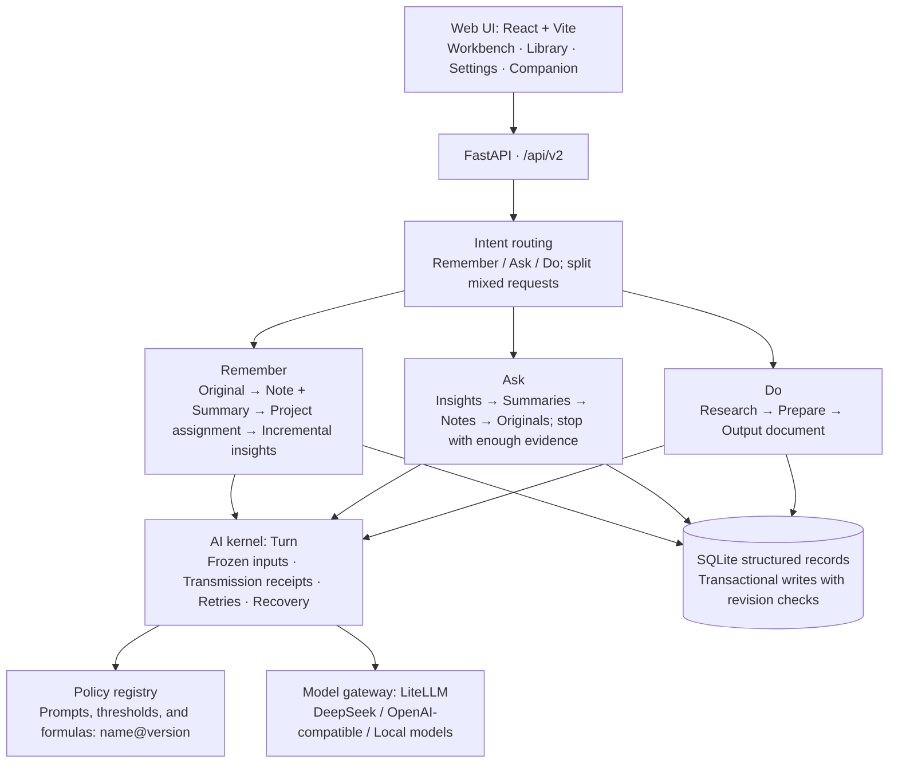

<div align="center">

[English](README.en.md) · [Chinese](README.md)


# Incremind

**A second brain that remembers what is new.**

Give it the material you choose. It organizes and archives it, extracts what adds to **what you already know**, and turns proposed insights into long-term memory only after you confirm them.

[Quick start](#quick-start) · [Features](#features) · [Usage](#usage) · [Architecture](#architecture) · [Privacy](#privacy-and-data) · [Development](#development)


[](LICENSE)


</div>

## Why I am building it

I want a second brain that can work alongside me over time.

The idea comes from everyday research. Whenever I ask AI a question or give it a task about the same project, I have to explain the background, my existing judgments, and the material I have already found all over again. Knowledge accumulates, but conversations often start from scratch.

Incremind is designed around two goals:

1. **Turn things I share into lasting knowledge.** Accept articles, personal judgments, recordings, videos, and ideas captured on the go; organize them by project and scene; and turn them into knowledge I can revisit and insights I can confirm.
2. **Use that knowledge to understand questions and complete tasks.** Identify what I am asking, find the relevant projects and scenes, and give the model their existing insights, sources, and context so it can answer everyday questions and handle routine tasks with less repeated explanation.

Saving articles and videos does not automatically make their contents useful or memorable. Incremind therefore focuses on **what each new source adds**:

- **Compare new material with existing insights.** Extract three kinds of changes: **additions** such as new conditions, examples, or practices; **differences** from an existing claim; and **new methods**. Material that repeats what you already know adds a supporting source to the existing insight rather than creating another entry.
- **Store methods with their conditions of use.** Each insight says when it applies, so relevant methods can be recalled when you ask a question or work on a task.
- **Let you decide what becomes established knowledge.** Extracted insights start as pending confirmation. A single click on the receipt activates them. Confirmation, edits, and forgetting take effect immediately; further inference runs in the background.
- **Remember and forget in a human-like way.** Frequently used knowledge becomes stronger, while unused knowledge gradually leaves automatic recall. Originals remain in the Library and can be found and restored at any time.

For example, an introductory article on spaced repetition might produce an insight about reviewing on days 1, 2, 4, 7, and 15. A later article on active recall and adaptive intervals should add only the relevant differences and methods: adjust intervals to difficulty, and try answering before revealing the answer.

## Features

| Status | Feature | What it does |
|---|---|---|
| ✅ | **One input box** | Automatically handles remembering, asking, and doing tasks. Mixed requests, such as a reminder followed by a question, are split and handled separately. |
| ✅ | **Automatic organization** | Builds memory in layers: original → organized note + summary → insight. Supports text, links, and PDFs. |
| ✅ | **Automatic project assignment** | Without an explicit `#Project`, assigns material to the most relevant existing project or creates one for a new topic. Everyday items stay in the Everyday space. Assignment can be undone with one click. |
| ✅ | **Incremental insights** | Compares material with existing insights and proposes additions, differences, and new methods for confirmation on the receipt. |
| ✅ | **Answers with citations** | Searches insights first, then summaries, organized notes, and originals as needed. Stops when there is enough evidence. Citations open the original source. Questions in Everyday can be routed to the relevant project. |
| ✅ | **Task execution** | Uses relevant memory to create output documents, which you can continue revising or regenerate. |
| ✅ | **Library** | Browse insights, summaries, organized notes, and originals; confirm, edit, forget, or restore insights. |
| ✅ | **Privacy controls** | Keeps data on your computer, excludes private projects from external model requests, and records a receipt for each external call. |
| 🧪 | More input formats | Image OCR, audio and video transcription, and Bilibili favorites import; requires the corresponding models to be configured. |
| 🧪 | Forgetting and daily organization | Adjusts recall weights by usage and a forgetting curve. Daily organization proposes patterns from recurring material for your confirmation. |
| 🧪 | Local embeddings | Install EmbeddingGemma from Settings, approximately 1.5 GB, for semantic retrieval without a network connection. |
| 🧪 | Claude Code and Codex integration | Let external agents query memory through MCP. Method insights can be exported as skills. See [the agent guide](docs/agents.md) (Chinese). |
| 🧪 | Servers and multiple users | Home or cloud server deployment, device pairing, backup, and recovery. See [the server guide](docs/server.md) (Chinese). |

✅ End-to-end flows have been exercised with a real model, DeepSeek. 🧪 Implemented with automated tests; validation in real environments is still in progress.

## Quick start

**Requirements:**

- Windows 10 or 11.
- [Python 3.12](https://www.python.org/downloads/). Select *Add python.exe to PATH* during installation.
- [Node.js 22 LTS](https://nodejs.org/), or version 20.19 or later.
- A model API key. [DeepSeek](https://platform.deepseek.com/) is the suggested provider; OpenAI-compatible endpoints are also supported.

**Three steps:**

1. Clone the repository into a short path, such as `D:\incremind`. Deep directory paths can encounter the Windows 260-character path limit.

   ```bash
   git clone https://github.com/qingmingyiyang/Incremind.git incremind
   ```

2. Double-click **`start.bat`** in the repository. The first run installs dependencies and takes a few minutes. Later launches normally take less than half a minute. Your browser opens at <http://127.0.0.1:4173>. Closing the terminal window stops the application.
3. Open **Settings → Models** and enter the endpoint URL, model name, and API key. The application interface currently uses Chinese; the names in this guide are English translations of its controls.

Send the example files in [`samples/`](samples/) to the Workbench in order to try organization, project assignment, and incremental insights. The sample material is in Chinese.

<details>
<summary>Data location, launch options, and backups</summary>

- Data is stored in the repository's `runtime/` directory by default and is excluded from Git.
- Choose another location: `start.bat -DataRoot D:\IncremindData`.
- Start without opening a browser: `start.bat -NoBrowser`.
- Startup logs are in `logs/`.
- To back up data, stop the application and copy the entire data directory, or use `tools/backup.py`. See the backup and recovery section of [the server guide](docs/server.md) (Chinese).

</details>

<details>
<summary>Developers: start the backend and frontend separately</summary>

Set up the dependencies from the repository root:

```powershell
py -3.12 -m venv .venv
.\.venv\Scripts\python.exe -m pip install -r requirements-web.txt -r requirements-dev.txt
cd src/frontend
npm ci
cd ../..
```

Run each command below in a separate PowerShell terminal at the repository root:

```powershell
.\run-web.ps1
```

The backend runs at <http://127.0.0.1:8001>. This script fixes the data root to `runtime/`.

```powershell
.\run-ui.ps1
```

The Vite development server runs at <http://127.0.0.1:4173> and proxies `/api` requests to port 8001.

For experiments with a temporary data directory, start the backend directly:

```powershell
$env:CHRIPTMAS_APP_ROOT = "$PWD\work\try-root"
$env:PYTHONPATH = "$PWD\src"
.\.venv\Scripts\python.exe -m uvicorn backend.memory_app.app:app --host 127.0.0.1 --port 8001
```

</details>

One-click startup is currently available for Windows. For Linux server deployment, see [the server guide](docs/server.md) (Chinese).

## Usage

The **Workbench** provides a single input box.

| Input | Result |
|---|---|
| Paste text or a link, or drop a file | **Remember:** create an organized note and summary, assign a project, and propose insights for confirmation. |
| Ask a question | **Ask:** answer using your memory, with citations. |
| Request a document or another piece of work | **Do:** create an output document using relevant memory. |
| Combine several requests | Split them into parts and handle each separately. |
| Begin with `#ProjectName` or `#ProjectName/Scene` | Specify the assignment or retrieval scope. Otherwise, the system infers it. |

On a receipt, use ✓ to confirm an insight or ✕ to dismiss it. The project assignment receipt also offers an undo action.

The **Library** groups insights, summaries, organized notes, and originals by project. Follow each layer down to its source evidence, or confirm, edit, forget, and restore insights here.

**Settings** contains model configuration, privacy controls, projects, data, and backups.

Open the **Companion** through the bear avatar in the upper-left corner to chat, review what you remembered this week, focus, or plan.

The screenshots below show the current Chinese interface.

<table>
<tr>
<td width="50%"><br/><sub>A mixed request is split; a question without an answer in Everyday is directed to the Learning Methods project.</sub></td>
<td width="50%"><br/><sub>The relevant project supplies the answer. Superscript citations open the original sources.</sub></td>
</tr>
<tr>
<td width="50%"><br/><sub>The Library separates pending and active insights and marks additions (+) and new insights (◇).</sub></td>
<td width="50%"><br/><sub>Choose models by purpose and control external transmission.</sub></td>
</tr>
<tr>
<td width="50%"><br/><sub>A mobile viewport in dark mode.</sub></td>
<td width="50%"></td>
</tr>
</table>

## Architecture



**Memory layers:** original (L0) → organized note (L1) + summary (L2) → insight (L3). Material is organized from the bottom up. Retrieval works from the top down: start with insights, descend when necessary, and stop when there is enough evidence.

**Design principles:**

- **Facts are append-only; derived results can be rebuilt.** Results that can be recomputed are treated as derived data.
- **Decision policies are versioned pure functions.** Prompts, thresholds, and assignment rules are registered as `name@version` in `src/backend/memory_app/v2/policies/`. Register a new algorithm version and switch the active selection; an earlier version can be selected again.
- **Three pipelines share one entry point.** Remembering, asking and doing, and learning use separate paths with a shared entry point, model gateway, and fact log.
- **Each fact has one owner.** Domain services own memory facts; the AI kernel owns execution facts. The orchestration layer and interface do not own persistent state.

**Repository layout:**

| Path | Contents |
|---|---|
| `src/backend/memory_app/` | Product application layer; ASGI entry point: `backend.memory_app.app:app`. |
| `src/backend/memory_app/v2/` | v2 endpoints and orchestration for the Workbench, Library, Settings, and related features. |
| `src/backend/memory_app/v2/policies/` | Versioned policies for intent, assignment, extraction, retrieval, ranking, and forgetting. |
| `src/backend/recognition/` | Insight domain: proposals, confirmation, revision, and forgetting. |
| `src/core/` | Domain and storage foundations, including the AI kernel, document engine, and SQLite storage; independent of the backend layer. |
| `src/frontend/` | Web interface. |
| `apps/desktop-electron/` | Desktop installer shell; release preparation is in progress. |
| `deploy/` | Server deployment templates for systemd and Caddy. |
| `tests/` | pytest and Vitest tests. |
| `samples/` | Example material for trying the application. |

Further documentation is available in [ARCHITECTURE.md](ARCHITECTURE.md) for architecture and interface contracts, [DESIGN.md](DESIGN.md) for the interface, and [COMPONENTS.md](COMPONENTS.md) for reusable capabilities. These documents are in Chinese.

## Privacy and data

- **Local first.** Sources, organized notes, insights, and conversations are stored in SQLite in your local data directory.
- **Encrypted credentials.** Model keys are encrypted with Windows DPAPI. Saved keys cannot be read back through the interface and are not written to logs.
- **Controlled external transmission.** External models are called only for purposes whose transmission switches you enable in **Settings → Models**. Private projects and sources are excluded. Every external request leaves a receipt recording what was sent and which model received it. See [the model guide](docs/models.md) (Chinese).
- **Originals are retained.** Forgetting affects automatic recall. Originals, organized notes, insight text, and revision history remain available for restoration.

## Development

Run backend tests and dependency checks from the repository root:

```powershell
.\.venv\Scripts\python.exe -m pytest tests/memory_app/v2 -q
.\.venv\Scripts\python.exe tools/run_import_linter.py
```

Run frontend tests and the build from `src/frontend/`:

```powershell
npm test
npm run build
```

- For prompt or algorithm changes, register a new version in `v2/policies/`, compare it offline, and switch `ACTIVE` in a separate commit.
- Use the design tokens in `src/frontend/src/styles.css` and the components in `shared/ui/` for frontend changes.
- Keep `README.md` and `README.en.md` in sync when updating the project description, feature status, or usage instructions.
- The commit hooks in `tools/task_guard.py` check for possible secrets, accidentally staged data directories, and newly added test-skip markers. After cloning, install them with `.\.venv\Scripts\python.exe tools/task_guard.py --install`.

## Known limitations

- **Speed:** remembering a source takes approximately 30–90 seconds, and asking a question 20–50 seconds. Much of this time is spent on local storage, with slower results on disks such as exFAT volumes. Optimization is in progress.
- **Platform:** end-to-end validation has been performed on Windows. The application interface is currently Chinese only.
- **In progress:** real-environment validation of the mobile shell, shared projects, and LAN or public server deployment.

## Acknowledgments

- Model integration draws on the protocol adapters and testing approach in [pi-ai](https://github.com/earendil-works/pi/tree/main/packages/ai).
- MCP and agent integration ideas draw on Mem0 OpenMemory, Supermemory, basic-memory, and TencentDB Agent Memory.
- Dependencies include [FastAPI](https://fastapi.tiangolo.com/), [LiteLLM](https://github.com/BerriAI/litellm), [LangGraph](https://github.com/langchain-ai/langgraph), [React](https://react.dev/), [Vite](https://vite.dev/), [ProseMirror](https://prosemirror.net/) (editor engine, MIT), and [sqlite-vec](https://github.com/asg017/sqlite-vec). Dependency listings are in `requirements-*.txt` and `src/frontend/package-lock.json`; consult the respective projects for their licenses.

## License

Copyright (C) 2026 Incremind contributors.

This project is licensed under the **GNU Affero General Public License v3.0 (AGPL-3.0-only)**. See [LICENSE](LICENSE) for the full terms.

If you offer a modified version over a network, you must provide its corresponding source code to users interacting with it, as required by the license.

Third-party components and data retain their own licenses and attribution requirements.
