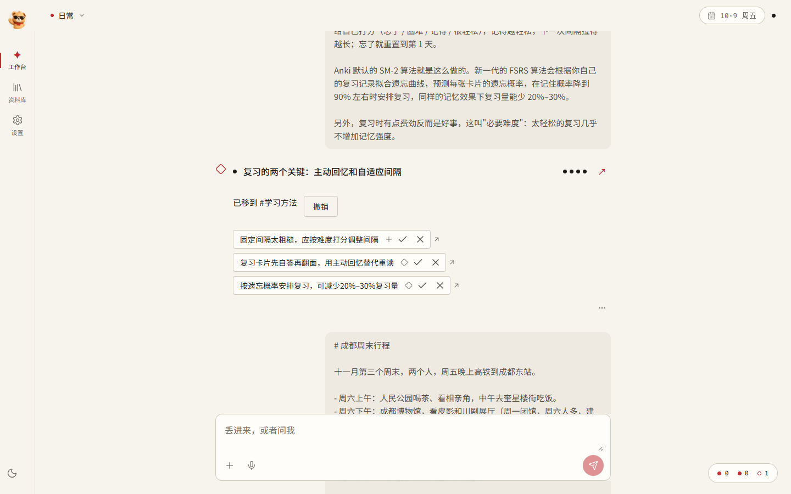
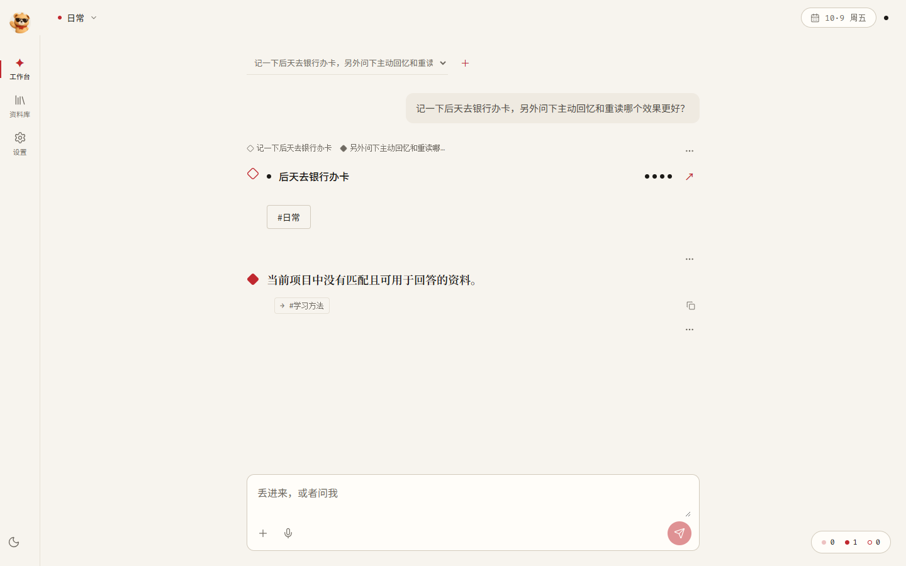
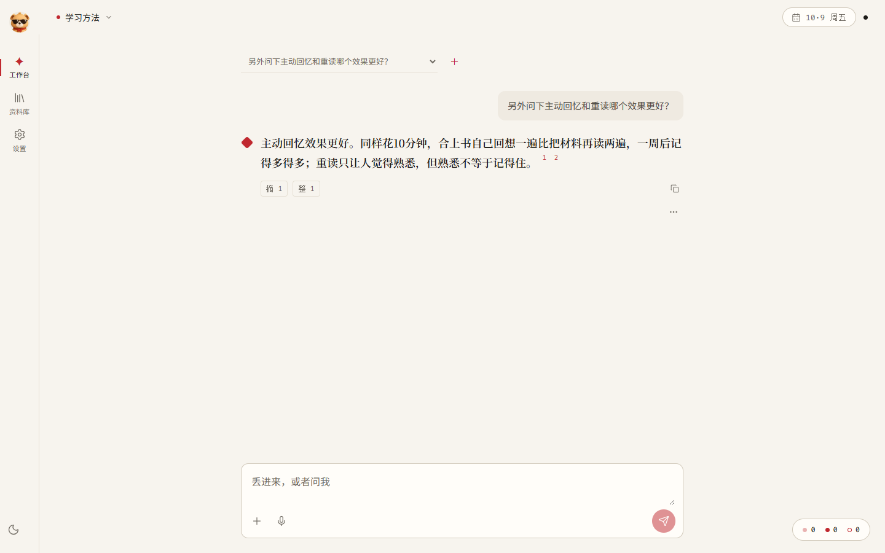
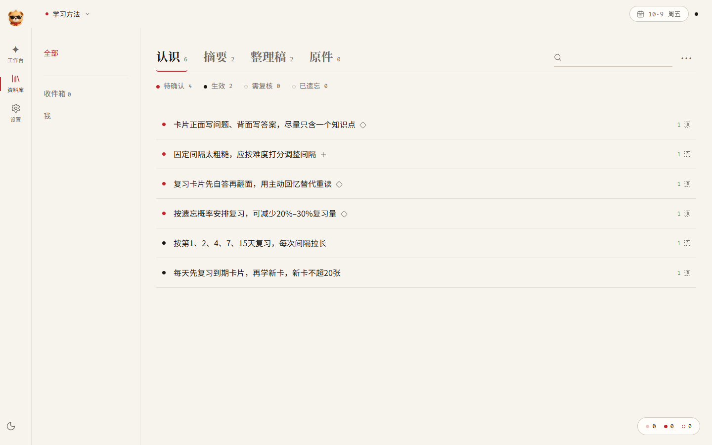
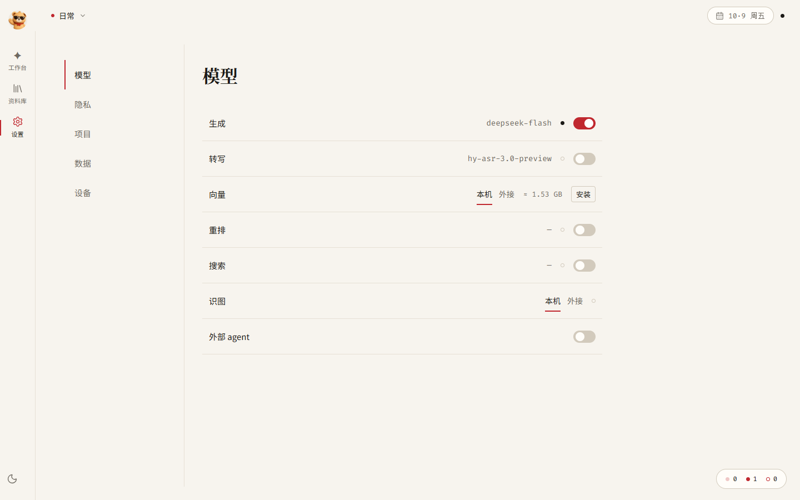
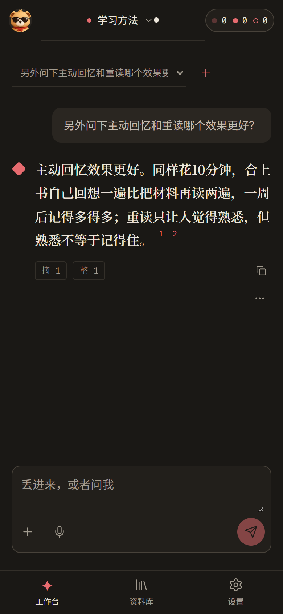
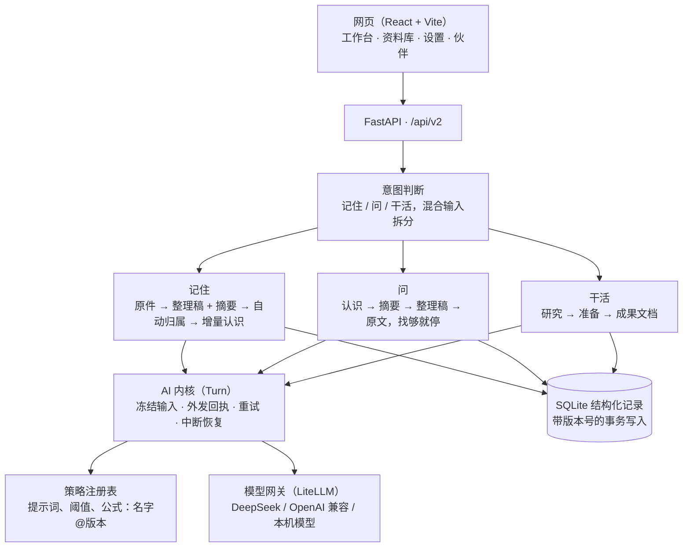

<div align="center">

[简体中文](README.md) · [English](README.en.md)


# Incremind · 积微

**只记增量的第二大脑**

把你挑过的资料交给它：它整理、归档，只提炼你**还不知道**的部分，等你一键确认，才成为长期记忆。

[快速开始](#快速开始) · [它能做什么](#它能做什么) · [怎么用](#怎么用) · [架构](#架构) · [隐私](#隐私与数据) · [开发](#开发)


[](LICENSE)




</div>

## 为什么做它

我想打造一个能长期陪我工作的第二大脑。

这个想法来自日常调研：围绕同一个项目，每次向 AI 提问或交办任务，都要重新讲一遍背景、已有判断和之前找到的资料。知识积累了很多，对话却常常从头开始。

Incremind 的设计围绕两件事展开：

1. **把随手投喂变成持续积累。** 接收文章、个人判断、录音、视频和随手记下的灵感，自动整理并归入对应的项目与场景，把资料沉淀成可以回看的知识和待确认的认识。
2. **带着已有积累理解问题并完成任务。** 根据我的要求识别问题，找到相关项目与场景，结合其中已有的认识、资料和上下文调用模型，回答基础问题、完成日常任务，减少反复交代背景。

收藏了很多文章和视频，真正记住、用上的却很少。因此，积累还需要有取舍：

Incremind 只记**信息增量**：

- **每份新资料都和你已有的认识对照**，只提炼三类内容：**补充**（新条件、例子、做法）、**不同**（和你已知的主张不一样）、**新方法**（你还没有的）。只是重复已知内容的资料，不新增条目，只给原来的认识多记一个来源。
- **方法按"什么时候该想起"来存**：每条认识都写明适用条件。问问题、干活时，按情境把该用的方法找回来。
- **你确认的才算数**：系统提炼的认识先是"待确认"，你在回执上一键 ✓ 才生效。确认、编辑、遗忘都当场生效；系统的推断放在后台慢慢做。
- **像人一样记和忘**：常用的越来越牢，不用的慢慢淡出自动召回，但原文永远在资料库里，随时能找回、一键恢复。

例子：先记一篇《间隔重复入门》，系统提炼出"按第 1、2、4、7、15 天复习"。几天后再记一篇讲"主动回忆和自适应间隔"的文章，它不会把间隔重复再讲一遍，只提出："固定间隔太粗糙，应该按难度调整"（不同）、"复习时先自答再翻面"（新方法）。

## 它能做什么

| | 功能 | 说明 |
|---|---|---|
| ✅ | **一个输入框** | 记住、问、干活不用选模式，系统自动判断；"记一下周五交物业费，另外问下……"这种混在一起的话会自动拆开分别处理 |
| ✅ | **自动整理** | 原件 → 整理稿 + 摘要 → 认识，逐层沉淀；支持文字、链接、PDF |
| ✅ | **自动归到项目** | 没写 `#项目` 时，自动归进最相关的已有项目，或为新主题新建一个；零散琐事留在"日常"。归错了一键撤销 |
| ✅ | **增量认识** | 对照已有认识，只提炼补充、不同和新方法；在回执上一键确认 |
| ✅ | **带引用的回答** | 先查认识，不够再查摘要、整理稿、原文，找够就停；回答里每处引用都能点开看原文。在"日常"里问不到时，自动去对应的项目里问 |
| ✅ | **干活** | 带着你的记忆写成果文档，可以接着改、重做 |
| ✅ | **资料库** | 认识、摘要、整理稿、原文四层下钻；确认、编辑、遗忘、恢复 |
| ✅ | **隐私可控** | 数据都在本机；私密项目不外发；每次调用外部模型都有回执 |
| 🧪 | 更多格式 | 图片识字、录音和视频转写、B 站收藏夹导入（需要在设置里配好对应模型） |
| 🧪 | 遗忘与每日整理 | 按使用频率和遗忘曲线降权；每天把反复出现的内容归纳成规律，等你确认 |
| 🧪 | 本机向量 | 设置里一键安装 EmbeddingGemma（约 1.5 GB），语义召回不用联网 |
| 🧪 | 接入 Claude Code、Codex | 通过 MCP 让它们查你的记忆；方法认识可导出成 skill，见 [docs/agents.md](docs/agents.md) |
| 🧪 | 服务器与多用户 | 家庭服务器或云服务器部署、设备配对、备份恢复，见 [docs/server.md](docs/server.md) |

✅ 已用真实模型（DeepSeek）完整走通；🧪 已实现并有自动化测试，真实环境验收还在进行。

## 快速开始

**需要：**

- Windows 10 / 11
- [Python 3.12](https://www.python.org/downloads/)（安装时勾选 *Add python.exe to PATH*）
- [Node.js 22 LTS](https://nodejs.org/)（或 20.19 以上）
- 一个大模型 API Key，推荐 [DeepSeek](https://platform.deepseek.com/)；任何 OpenAI 兼容接口都可以

**三步：**

1. 下载代码，放在较短的路径下（例如 `D:\incremind`；路径太深会碰到 Windows 260 字符的路径上限）：

   ```bash
   git clone https://github.com/qingmingyiyang/Incremind.git incremind
   ```

2. 双击仓库里的 **`start.bat`**。第一次运行会自动安装依赖（几分钟），之后半分钟内启动，浏览器自动打开 <http://127.0.0.1:4173>。关掉这个黑色窗口就停止。
3. 打开 **设置 · 模型**，填入模型的接口地址、模型名和 API Key。

然后把 [`samples/`](samples/) 里的示例资料依次发进工作台，就能看到整理、自动归属和增量认识的效果。

<details>
<summary>数据放在哪、怎么换位置</summary>

- 所有数据默认在仓库下的 `runtime/`，不进 Git。
- 想放到别处：`start.bat -DataRoot D:\IncremindData`
- 只启动、不自动开浏览器：`start.bat -NoBrowser`
- 启动日志在 `logs/`。
- 备份：停止后把整个数据目录复制一份，或用 `tools/backup.py`（见 [docs/server.md](docs/server.md#备份与恢复)）。

</details>

<details>
<summary>开发者：分别启动后端和网页</summary>

```powershell
py -3.12 -m venv .venv
.\.venv\Scripts\python.exe -m pip install -r requirements-web.txt -r requirements-dev.txt
cd src/frontend; npm ci; cd ../..

.\run-web.ps1    # 后端 http://127.0.0.1:8001，数据根固定为 runtime/
.\run-ui.ps1     # 网页 http://127.0.0.1:4173（Vite 开发服务器，代理 /api 到 8001）
```

用临时数据目录试验时，不要用 `run-web.ps1`，改为直接启动：

```powershell
$env:CHRIPTMAS_APP_ROOT = "$PWD\work\try-root"
$env:PYTHONPATH = "$PWD\src"
.\.venv\Scripts\python.exe -m uvicorn backend.memory_app.app:app --host 127.0.0.1 --port 8001
```

</details>

macOS 和 Linux 暂时没有一键启动；Linux 服务器部署见 [docs/server.md](docs/server.md)。

## 怎么用

**工作台**：唯一的输入框。

| 你输入 | 系统做什么 |
|---|---|
| 粘贴一段文字、一个链接，或拖进文件 | **记住**：整理成整理稿和摘要，归到项目，提炼待确认的认识 |
| 一个问题 | **问**：从你的记忆里找答案，带引用 |
| "帮我写……""整理一份……" | **干活**：带着相关记忆生成成果文档 |
| 混在一起的一句话 | 自动拆成几部分，分别处理 |
| 开头写 `#项目名` 或 `#项目名/场景` | 指定归属或提问范围；不写就自动判断 |

回执上的认识可以直接 ✓ 确认或 ✕ 不要；"已移到 #项目"旁边可以撤销自动归属。

**资料库**：按项目看全部认识、摘要、整理稿和原文，逐层下钻到原文证据；在这里确认、编辑、遗忘或恢复。

**设置**：模型、隐私（哪些项目私密）、项目、数据与备份。

**伙伴**：点左上角的小熊，可以聊聊、回顾这周记住了什么、专注和安排。

<table>
<tr>
<td width="50%"><br/><sub>一句话拆成"记住"和"问"；"日常"里找不到答案，指向"学习方法"</sub></td>
<td width="50%"><br/><sub>自动转到"学习方法"项目里回答，上标数字可点开原文</sub></td>
</tr>
<tr>
<td width="50%"><br/><sub>资料库：认识分待确认和生效，标出补充（＋）和新增（◇）</sub></td>
<td width="50%"><br/><sub>设置：按用途选模型，外发开关一目了然</sub></td>
</tr>
<tr>
<td width="50%"><br/><sub>手机尺寸、深色主题</sub></td>
<td width="50%"></td>
</tr>
</table>

## 架构



**记忆阶梯**：原件（L0）→ 整理稿（L1）+ 摘要（L2）→ 认识（L3）。存的时候自下而上沉淀，问的时候自上而下找：先查认识，不够再往下一层，找够就停。

**几条设计原则：**

- **事实只追加，推导可重建**：能重新算出来的都不当作事实存。
- **决策点是带版本号的纯函数**：提示词、阈值、归属规则都登记成 `名字@版本`（在 `src/backend/memory_app/v2/policies/`）。换算法就是登记新版本、切换一行；改回来就是回退。
- **三条管线，一个入口**：记住、问和干活、学习三条路径分开，共用入口、模型网关和事实日志。
- **每个事实只有一个主人**：记忆事实归领域服务，执行事实归 AI 内核；编排层和界面不存状态。

**目录：**

| 路径 | 内容 |
|---|---|
| `src/backend/memory_app/` | 产品应用层，ASGI 入口 `backend.memory_app.app:app` |
| `src/backend/memory_app/v2/` | 工作台、资料库、设置等全部 v2 接口与编排 |
| `src/backend/memory_app/v2/policies/` | 带版本号的策略：意图、归属、提炼、召回、排序、遗忘…… |
| `src/backend/recognition/` | 认识领域：候选、确认、修订、遗忘 |
| `src/core/` | 领域与存储底座（AI 内核、文档引擎、SQLite 存储），不依赖 backend |
| `src/frontend/` | 网页 |
| `apps/desktop-electron/` | 桌面安装包外壳（发行准备中） |
| `deploy/` | 服务器部署模板（systemd、Caddy） |
| `tests/` | pytest 与 vitest 测试 |
| `samples/` | 体验用的示例资料 |

更细的设计见 [ARCHITECTURE.md](ARCHITECTURE.md)（架构与接口约定）、[DESIGN.md](DESIGN.md)（界面）和 [COMPONENTS.md](COMPONENTS.md)（可复用能力）。

## 隐私与数据

- **本地优先**：资料、整理稿、认识和对话都存在本机数据目录的 SQLite 里。
- **密钥加密**：模型密钥用 Windows DPAPI 加密，保存后界面上读不回来，不写日志。
- **外发可控**：只有你在 **设置 · 模型** 里打开外发开关的用途才会调用外部模型；标成**私密**的项目和资料永远不外发；每次外发都留回执，写明发了什么、给了哪个模型。详见 [docs/models.md](docs/models.md)。
- **不删原件**：遗忘只影响自动召回，原件、整理稿、认识正文和历史修订都保留，随时恢复。

## 开发

```powershell
.\.venv\Scripts\python.exe -m pytest tests/memory_app/v2 -q   # 后端测试
cd src/frontend; npm test; npm run build                       # 前端测试与构建
.\.venv\Scripts\python.exe tools/run_import_linter.py          # 依赖方向检查
```

- 改提示词或算法：在 `v2/policies/` 登记新版本，离线对比后，单独一次提交切换 `ACTIVE`。
- 前端只用 `src/frontend/src/styles.css` 里的设计 token 和 `shared/ui/` 组件。
- 更新项目介绍、功能状态或使用说明时，同步维护 `README.md` 和 `README.en.md`。
- 提交前钩子 `tools/task_guard.py` 会检查疑似密钥、误提交的数据目录和新增的跳过标记；新克隆后运行一次 `.\.venv\Scripts\python.exe tools/task_guard.py --install` 安装。

## 已知限制

- **速度**：记住一份资料约 30–90 秒，提问约 20–50 秒，大部分时间花在本地存储上；在 exFAT 等慢盘上更慢。正在优化。
- **平台**：只在 Windows 上完整验证；界面只有中文。
- **在路上**：手机外壳、共享项目、局域网和公网服务器的真实环境验收。

## 致谢

- 模型接入参考了 [pi-ai](https://github.com/earendil-works/pi/tree/main/packages/ai) 的协议适配与测试方法。
- MCP 接入、代理接入等思路借鉴了 Mem0 OpenMemory、Supermemory、basic-memory 和 TencentDB Agent Memory。
- 用到的开源项目包括 [FastAPI](https://fastapi.tiangolo.com/)、[LiteLLM](https://github.com/BerriAI/litellm)、[LangGraph](https://github.com/langchain-ai/langgraph)、[React](https://react.dev/)、[Vite](https://vite.dev/)、[ProseMirror](https://prosemirror.net/)（编辑器内核，MIT）、[sqlite-vec](https://github.com/asg017/sqlite-vec)。各依赖的许可证见 `requirements-*.txt` 与 `src/frontend/package-lock.json`。

## 许可证

Copyright (C) 2026 Incremind contributors.

本项目采用 **GNU Affero General Public License v3.0（AGPL-3.0-only）**，完整条款见 [LICENSE](LICENSE)。

修改后的版本通过网络提供服务时，须按协议向与其交互的用户提供对应源代码。

第三方组件与数据保留各自的许可证和署名要求。
